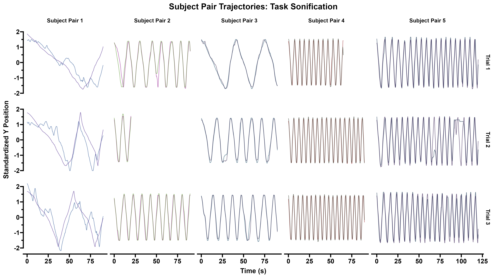

```{r project_variables, include=FALSE}

# MoCap
qtm_version <- "2022.2 (build 7700)"
n_tracking_cams <- 8
n_video_cams <- 1
capture_freq <- 300

# Bela
bela_version <- "0.3.8g"
bela_freq <- 44100
bela_buffer_size <- 32
bela_n_channels <- 2
```

```{r setup, include=FALSE, cache = FALSE}

# set working directory if it isn't the directory of this file
wd <- getwd()
if (basename(wd) != "docs") {
    wd <- paste0(wd, "/docs")
    setwd(wd)
}

options(knitr.graphics.auto_pdf = TRUE)
knitr::opts_knit$set(root.dir = wd)
knitr::opts_chunk$set(echo = TRUE)
bookdown::pdf_document2()
# this leaves all of the intermediate files in the dir if FALSE
options(tinytex.clean = FALSE)
# make verbose TRUE to help with debugging
options(tinytex.verbose = FALSE)

# set default cran mirror
r <- getOption("repos")
r["CRAN"] <- "https://mirrors.dotsrc.org/cran/" # Denmark
options(repos = r)
rm(r)

# use this function to load packages to save manual installation
use_package <- function(p) {
    if (!is.element(p, installed.packages()[, 1]))
        install.packages(p, dep = TRUE)
    require(p, character.only = TRUE)
}
use_package("bookdown")
use_package("rticles")
use_package("tidyverse")
use_package("ggprism")
use_package("gsignal")
# The following are used in the preprocessing pipieline
use_package("mousetrap")

# after all the packages are loaded, we can save
# a bibliography of all the packages used
# in case we need to cite them
knitr::write_bib(.packages(), "packages.bib")

# For a quick reference, the following citation commands can be used:
# - @zammSynchronizingMIDIWireless2019  ->  "Author et al. (2001)"
# - [@walkerMUSICALSOUNDSCAPESACCESSIBLE2007] -> "(Author et al., 2001)"
# - [@vinkenAuditoryCodingHuman2013; @umekSuitabilityStrainGage2017] -> "(Author1 et al., 2001; Author2 et al., 2002)"

```

# `r rmarkdown::metadata$title`

Joint action tasks form an integral part of the everyday life of humans and many other species [ref],
and the mechanisms underlying this cooperative ability to work together towards a common goal have been 
the subject of an increasing number of publications [ref, scholar search?]. Many types of cooperation 
involve auditory perception as a key aspect, either as the focus of the task – as is the case for 
musicians in a band – or as a component that can be leveraged for increasing synchronization, 
for example with a steady beat to set the pace for rowers. For any time-sensitive task making 
use of auditory feedback, having low latency is vital to ensure the sonification feels connected 
to the action, rather than disjointed [ref]. While there has been research into the effects of 
sonification on joint action [ref], this thesis presents a flexible low latency sonification 
framework that uses real-time positional data for joint action research. This framework has been 
implemented in a pilot study to investigate the utility of a novel joint action synchrony paradigm 
that puts the focus of the sonification strategy as a core aspect of study design in this field. By 
comparing subject synchronization during experiments employing task-oriented or synchronization-oriented 
strategies, we have attempted to show differences that highlight the importance of strategy selection 
for sonification and provide a pathway for further investigation.

# Background

## Joint Action

Joint actions, where two or more people synchronize their actions in pursuit of a shared goal [@knoblichPsychologicalResearchJoint2011], are a regular part of human behaviour. Examples include handshakes, conversations, musical performances… dancing

What are the cognitive processes involved in joint action? Recent theory suggests that the main cognitive processes involved include representations, action monitoring and action prediction [@vesperMinimalArchitectureJoint2010; @loehrMonitoringIndividualJoint2013; @sebanzJointActionBodies2006].

### Representations

According to the minimal architecture for joint action proposed by @vesperMinimalArchitectureJoint2010, an agent involved in joint action must, at a minimum, have a representation of their own task and the shared goal. While it is not required, it is usually helpful to also represent the other’s task, as it allows for more precise predictions of what the other will do next [@boltSensoryAttenuationAuditory2021]. As an example, consider two singers performing a duet together. Each singer must fully know their own part, while also representing the shared goal of synchronized singing. Although these two main representations can be sufficient for performing a duet, professional singers typically familiarize themselves with their singing partner's part in addition to their own, as it allows for a more polished and cohesive musical performance. 

Further insight into the role of representations in joint action comes from an EEG study by @kourtisPredictiveRepresentationOther2012, which found that partners represented each other’s actions in advance when passing an object, and doing so facilitated coordination. Having these shared representations of actions and their underlying goals allows individuals to establish a procedural common ground for joint action without needing to rely on symbolic communication [@sebanzJointActionBodies2006].

### Action Monitoring

Monitoring processes are used to assess the extent to which a task or goal is being accomplished and whether actions are proceeding as intended (Botvinick et al., 2001). In terms of assessing task and goal progress, three things can be monitored: one's own task, the other’s task, and the shared goal. As with representations, one must at least monitor the progress of one’s own task and the shared goal. It is not strictly necessary to monitor the other’s task, and it depends on the type of joint action that is performed. Nevertheless, it is likely true that monitoring what one’s partner is doing will improve joint action performance – especially for tasks that require precise synchronization [@vesperMinimalArchitectureJoint2010].

### Action Predicting

In order to coordinate effectively, it is often necessary to make predictions about future events. This prediction process is achieved through motor simulation, which uses internal models to determine the sensory consequences of actions as well as their effect on the environment (Vesper et al., 2010).

### Integrating Predicted Outcomes of One’s Own and Others’ Actions 

The crucial final feature of joint action is the manner in which individuals adapt their own actions to those of others in time and space. The question concerns the decision-making process that occurs after a prediction of another person’s action is made, i.e. choosing a suitable complementary action and performing it at the appropriate time. In order to avoid constantly being one step behind during joint action, interacting partners cannot simply respond to observed actions, but must rather plan their own actions in relation to what they predict their partner will do [@sebanzJointActionBodies2006]. A study by Knoblich and Jordan [Sebanz 43-34] using a joint action tracking paradigm found that partners planned their actions based on a prediction of what the joint effect of both their own and their partner’s actions would be.

Some of the questions that have been investigated in recent joint action research concern the aforementioned processes (representations, action monitoring and action predicting) and how they relate to agency (self vs other) and outcome (individual vs joint). Researchers have studied whether agents involved in joint action represent both their own task and their partner’s task (citation), whether they monitor individual outcomes or joint outcomes, and 

### Current Study

The current study had participants perform a joint action task under three different conditions, where the sensory consequences were manipulated through real-time sonification of movement.

The current study focuses on what happens during learning of joint action. Through movement sonification, we can enhance attention towards specific features of joint action. Is learning optimized when focusing on self-other representations or joint outcome representations?

While we could not completely separate the conditions, our sonifications focus attention towards either self-other monitoring, or joint outcome.


## Sonification

Sonification is defined as the use of nonspeech audio to convey information. More specifically, sonification is the transformation of data relations into perceived relations in an acoustic signal for the purposes of facilitating communication or interpretation [@kramerSonificationReportStatus1999, p. 4].

While concepts around sonification and audification were not formalized until around the year 1992 when the first International Conference on Auditory Display (ICAD) was held [@dubusSonificationPhysicalQuantities2011], practical examples of sonification can be found throughout history. Water clocks in ancient Greece and medieval China were sometimes constructed to produce sounds and thereby provide auditory information about the passage of time [@dubusSonificationPhysicalQuantities2011]. The stethoscope, which is used for listening to sounds made by the heart and lungs as well as other internal sounds of the body, was invented in 1816 by French physician and amateur musician Rene Laënnec [@roguinReneTheophileHyacinthe2006]. The Geiger counter developed in 1928 provides perhaps the most characteristic example of sonification through its function of sonifying levels of radiation. The device detects ionizing radiation and translates it into audible clicks, where a faster tempo signifies a higher level of radiation. @dubusSonificationPhysicalQuantities2011 describe the value of the Geiger counter as “transposing a physical quantity which is essentially non-visual and pictured in everyone’s imagination as very important because life-threatening, to the auditory modality through clicks with a varying pulse”.

### What is sonification useful for?

Making sense of large amounts of data, and utilizing modern powerful media technologies. “Sonification research is well positioned to provide technology to assist scientists in comprehending the information and data-rich world of today and of the future.”. “The wide availability of audio technology (e.g., in multimedia computers) makes auditory data representation a viable option for large numbers of users. Thus, there exists today a synergism between the widespread need for new data comprehension methods and readily available technology that, with proper support and funding, can lead to a large number of users reaping the benefits conferred by the development of scientific sonification.” [@kramerSonificationReportStatus1999]

### Movement sonification

“Approaches within the discipline of Sport Science reflect the whole range from fundamental research with high internal validity to applied research with high ecological validity. Applied research plays an important role for the development of new, more effective intervention methods. Assuming that more senses are more powerful in perceiving gross motor patterns it should be supportive to create and convey more acoustic movement information. For multisensory integration benefits, additional auditory movement information has to correspond to the structure of a perceptual feature stream of another modality (visual, kinesthetic, tactile). For such an acoustic enhancement of motor perception Effenberg (1996, 2004, 2005) has established the concept of 'movement sonification', adapting the sonification approach of the early 1990s to the kinematics and dynamics of human motor behavior.” One of the movement parameters that can be used is “kinematic parameters representing the spatiotemporal features of a pose or a movement pattern.” “The question whether dynamic or kinematic movement parameters should be chosen for movement sonification should be answered under consideration of the sensory modality or modalities with which bi- or multimodal convergence should be achieved: If visual motion perception is the reference, movement sonification should be based on kinematic parameters.” [@gerdschmitzSoundJoinedActions2017]

> “Subjects are able to perceive differences in swimming stroke frequency more accurately when visualizations of a swimmer are complemented with a kinematic sonification.” [@gerdschmitzSoundJoinedActions2017]

### Auditory perception

Research into auditory perception indicates two basic features of auditory perception that provide good arguments for representing data as sound. First, auditory perception is especially useful for detecting temporal characteristics, i.e. variations in sound over time. [find study that said we’re better at detecting rhythm aurally vs visually?] Sonification can thus be useful for monitoring or understanding complex temporal data. Second, our sense of hearing does not require us to be oriented towards the sound source. Unlike visual perception, which allows us to perceive approximately 180 degrees of our environment in front of us while we remain blind to the other 180 degrees behind us, auditory perception allows perception of 360 degrees. This makes auditory signals particularly useful for situations where our visual system is occupied with another task and we cannot afford to look around constantly, such as monitoring and alarm applications. [@kramerSonificationReportStatus1999]

Other benefits of auditory perception that speak for sonification: parallel listening (ability to monitor and process multiple auditory data sets), rapid detection (especially in high-stress environments), affective response (ease of learning and high engagement qualities) and auditory gestalt formation (discerning relationships or trends in data streams) [@kramerSonificationReportStatus1999]


# Methods

## Pilot Experiment

A pilot experiment was conducted that required subjects to…

Describe exp setup and subject demographics etc. See Figure \@ref(fig:track-setup)

```{r track-setup, echo=FALSE, fig.align='center', fig.cap='Experimental track setup', out.width="100%"}

```

## Hardware and Software

### Motion Capture

Motion capture data were collected using a `r n_tracking_cams + n_video_cams` (`r n_tracking_cams` Qualisys Miqus M3 marker and `r n_video_cams` Qualisys Miqus Video) camera system connected to a Qualisys Camera Sync Unit.
Marker data were acquired at a sampling rate of `r capture_freq` Hz and video data were acquired at a sampling rate of 25 Hz. Qualisys Track Manager version `r qtm_version` software was used to collect and process the data with real-time 3D tracking data output.


#### Markers

For the experimental set up, one passive marker was placed on each car, and additional passive markers were placed at the start and end of each track, as well as one passive marker on each corner of the surface the tracke was mounted on (see Fig X).
These additional markers provided reference points for 3D orientation of the track and the cars across trials in case of accidental table movement.

### Sonification

#### Hardware

Motion capture data were sent via UDP packets over USB networking to a Bela Mini device running version `r bela_version` running a custom C++ program[^code]. The main program loop 
was configured to execute every `r bela_buffer_size` samples, with an output sample rate of `r bela_freq` Hz for `r bela_n_channels` audio channels. The stereo audio output was split into
two channels which were connected to a pair of Genelec G Two active speakers.

[^code]: Source, data and analyses are available at [`r rmarkdown::metadata$repository`](`r rmarkdown::metadata$repository`)

#### Software

The main program used the Bela platform franework from 10 August 2022[^belaplatform].

[^belaplatform]: https://github.com/BelaPlatform/Bela/commit/42bbf18c3710ed82cdf24b09ab72ac2239bf148e

## Experimental Design

# Analysis

```{r hilbert_transform, include=FALSE, echo=FALSE}
# load the data
# load("../data/standardized_trajectories.Rda.bz2")
# # data is available in "trajectories"

# # for each experiment_id (subject pair)
# # calculate the hilbert transform of the y position
# # per trial and per condition for both subjects
# trajectories$y_hilbert <- NA_complex_
# trajectories$y_std_hilbert <- NA_complex_
# for (experiment_id in unique(trajectories$experiment_id)) {
#   # get the data for this experiment
#   exp_data <- trajectories[trajectories$experiment_id == experiment_id, ]
#   # for each condition
#   for (condition in unique(exp_data$condition)) {
#     # get the data for this condition
#     cond_data <- exp_data[exp_data$condition == condition, ]
#     # for each trial
#     for (trial in unique(cond_data$trial)) {
#       # get the data for this trial
#       trial_data <- cond_data[cond_data$trial == trial, ]
#       # for each subject
#       for (subject in unique(trial_data$subj)) {
#         # get the data for this subject
#         subject_data <- trial_data[trial_data$subj == subject, ]
#         # calculate the hilbert transform of the y position
#         subject_data$y_hilbert <- hilbert(subject_data$ypos)
#         subject_data$y_std_hilbert <- hilbert(subject_data$z_ypos)
#         # save the data
#         trajectories[
#           trajectories$experiment_id == experiment_id &
#           trajectories$condition == condition &
#           trajectories$trial == trial &
#           trajectories$subj == subject, ] <- subject_data
#       }
#     }
#   }
# }

# # plot the hilbert transform of the y position
# trajectories %>% dplyr::filter(condition == "Sync") %>%
#   ggplot(aes(x = timestamps, y = Re(y_hilbert))) +
#     geom_line(color = "blue") +
#     geom_line(aes(y = Im(y_hilbert)), color = "red") +
#     facet_grid(condition ~ subj) +
#     theme_bw() +
#     theme(
#       axis.text.x = element_blank(),
#       axis.ticks.x = element_blank(),
#       axis.title.x = element_blank(),
#       axis.title.y = element_blank(),
#       strip.text = element_text(size = 20),
#       strip.background = element_blank()
#     )


```

```{r mt-trajectories, echo=FALSE, fig.cap="Plot of trajectories from subject pairs in the Task-oriented sonification condition", fig.align="center", out.width="100%"}

```

Test cross-ref, see figure \@ref(fig:mt-trajectories)


# Results

# Discussion


<div id="refs"></div>