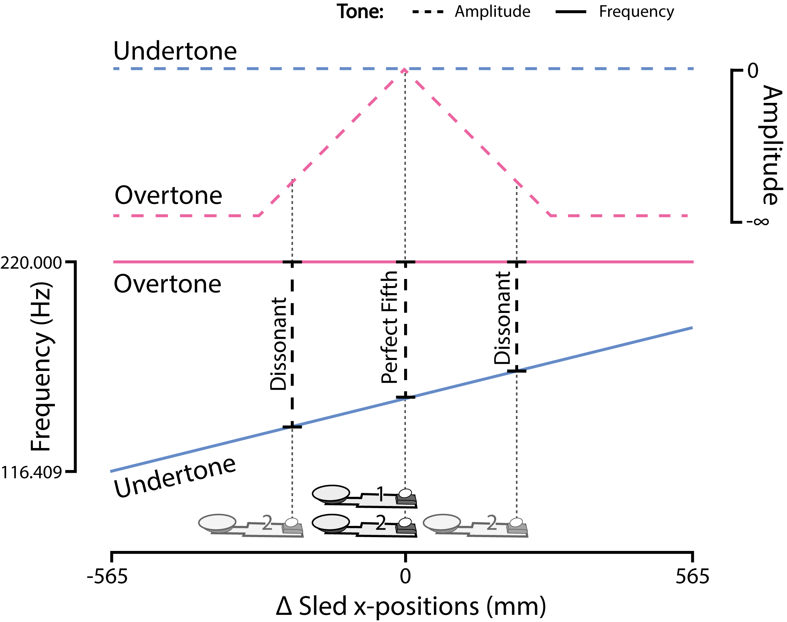
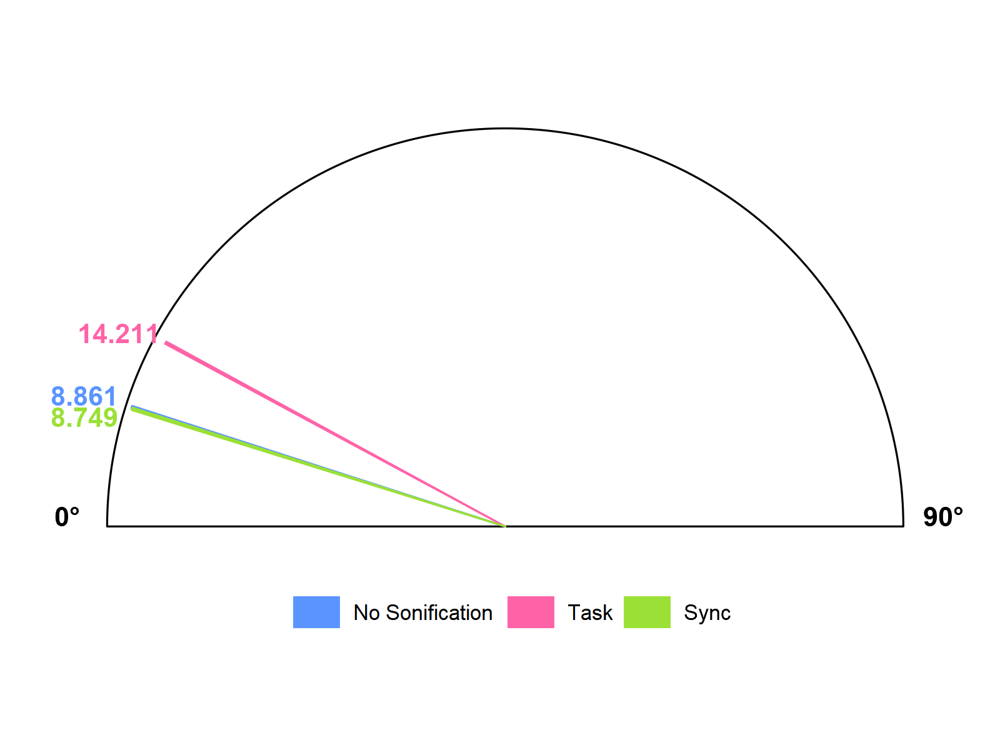
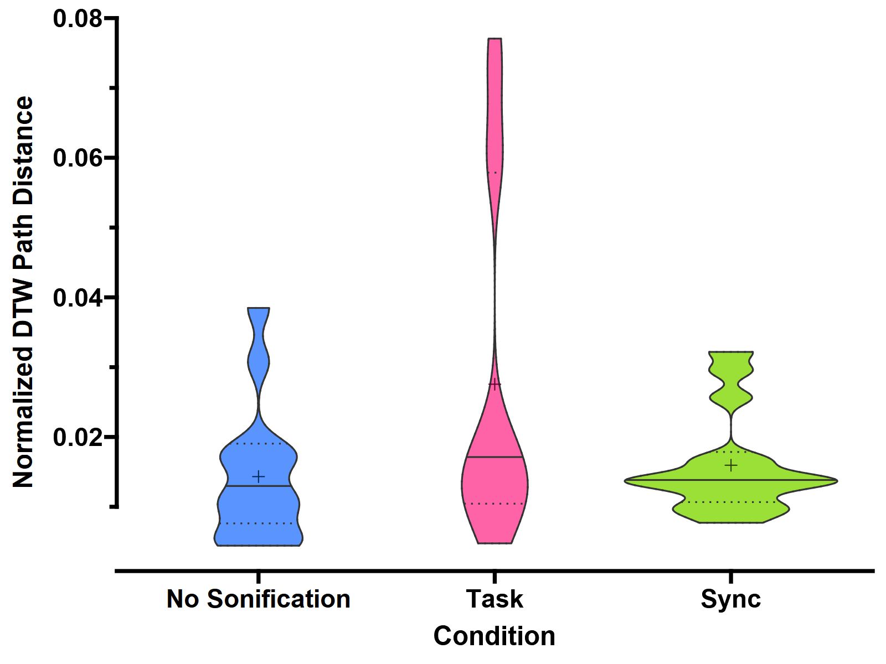

```{r project_variables, include=FALSE}

# MoCap
qtm_version <- "2022.2 (build 7700)"
n_tracking_cams <- 8
n_video_cams <- 1
capture_freq <- 300

# Bela
bela_version <- "0.3.8g"
bela_freq <- 44100
bela_buffer_size <- 32
bela_n_channels <- 2
undertone_stimulus <- "../src/res/simple_As2.wav"
overtone_stimulus <- "../src/res/simple_f3.wav"
stimuli_freq <- bela_freq # Hz

# Data
trajectories_file <- "../data/standardized_trajectories.Rda.bz2"
cache_dir <- ".cache"
```

```{r setup, include=FALSE, cache=FALSE}

# set working directory if it isn't the directory of this file
wd <- getwd()
wd_parent <- dirname(wd)
if (basename(wd) != "docs") {
    wd_parent <- wd
    wd <- paste0(wd, "/docs")
    setwd(wd)
}


# set default cran mirror
r <- getOption("repos")
r["CRAN"] <- "https://mirrors.dotsrc.org/cran/" # Denmark
options(repos = r)
rm(r)


# use this function to load packages to save manual installation
use_package <- function(p) {
    if (!is.element(p, installed.packages()[, 1]))
        if(p == "unigd") remotes::install_github("nx10/unigd")
        else install.packages(p, dep = TRUE)
    require(p, character.only = TRUE)
}
use_package("remotes")
use_package("kableExtra")
use_package("bookdown")
use_package("rticles")
use_package("conflicted")
use_package("tidyverse")
use_package("easystats")
use_package("ggprism")
use_package("gsignal")
use_package("circular")
use_package("Directional")
use_package("pracma")
use_package("grid")
use_package("gridExtra")
use_package("colorspace")
use_package("sjPlot")
use_package("sjlabelled")
use_package("sjmisc")
use_package("broom.mixed")
use_package("DiagrammeR")
use_package("DiagrammeRsvg")
use_package("rsvg")
use_package("wav")
use_package("zoo")
use_package("dtw")
use_package("unigd")
use_package("ggthemes")
use_package("astsa")
use_package("unigd")
use_package("signal")
use_package("lme4")
use_package("lmerTest")


options(knitr.graphics.auto_pdf = TRUE)
options(knitr.table.format = "latex")
knitr::opts_knit$set(root.dir = wd)
knitr::opts_chunk$set(echo = FALSE)
knitr::opts_chunk$set(fig.pos = 'h')
# opts_knit$set(eval.after = "fig.cap")
# this leaves all of the intermediate files in the dir if FALSE
options(tinytex.clean = FALSE)
# make verbose TRUE to help with debugging
options(tinytex.verbose = FALSE)

######################
# NOTE
#####################
# https://github.com/easystats/report
# and install easystats too....

# options(mc.cores = parallel::detectCores())
# The following are used in the preprocessing pipieline
use_package("mousetrap")

# define base palette
colorblind_friendly_pal <- c("#0074e7", "#e7298a", "#8bcf00")
# darker version
colorblind_friendly_pal_dark <- darken(colorblind_friendly_pal, 0.5)
# make it slightly less intense
colorblind_friendly_pal <- lighten(colorblind_friendly_pal, 0.25)
options(ggplot2.discrete.colour=colorblind_friendly_pal)
options(ggplot2.discrete.fill=colorblind_friendly_pal)
figure_width <- 1600
figure_height <- 1200

# set default rounding
options(digits = 6)

# after all the packages are loaded, we can save
# a bibliography of all the packages used
# in case we need to cite them
knitr::write_bib(.packages(), "packages.bib")

# For a quick reference, the following citation commands can be used:
# - @zammSynchronizingMIDIWireless2019  ->  "Author et al. (2001)"
# - [@walkerMUSICALSOUNDSCAPESACCESSIBLE2007] -> "(Author et al., 2001)"
# - [@vinkenAuditoryCodingHuman2013; @umekSuitabilityStrainGage2017] -> "(Author1 et al., 2001; Author2 et al., 2002)"

```

```{r hilbert_transform, include=FALSE}
# this is slow, so check for a cached version
trajectories_with_hilbert <-
    paste0(cache_dir, "/trajectories_with_hilbert.rds.bz2")
# if the cached version exists, use it!
if (file.exists(trajectories_with_hilbert)) {
    angular_trajectories <- readRDS(trajectories_with_hilbert)
    rm(trajectories_with_hilbert)
} else {
    # load the data
    load(trajectories_file)
    # data is available in "trajectories"
    angle_difference_vector <- function(angle1, angle2) {
      diff <- angle2 - angle1
      # circular handles the modulo for us
      # diff[diff > 90] <- diff[diff > 90] - 180
      # diff[diff < -90] <- diff[diff < -90] + 180
      diff
    }

    # for each experiment_id (subject pair)
    # calculate the hilbert transform of the y position
    # per trial and per condition for both subjects

    trajectories$y_std_hilbert <- NA_complex_
    trajectories$instantaneous_phase_angle <- NA_real_ # in radians

    trajectories <- trajectories %>%
      group_by(experiment_id, condition, trial, subj) %>%
      group_modify(~ {
        # calculate the hilbert transform of the y position
        y_hilbert <- hilbert(.x$z_ypos)
        # calculate the instantaneous phase angle
        instantaneous_phase_angle <- rad2deg(pracma::angle(y_hilbert))
        # make instantaneous phase angle a circular object
        # instantaneous_phase_angle <- circular(
        #     instantaneous_phase_angle,
        #     units = "radians",
        #     modulo = "pi")
        # add the hilbert transform and instantaneous phase angle to the data
        .x$y_std_hilbert <- y_hilbert
        .x$instantaneous_phase_angle <- instantaneous_phase_angle
        .x
      }) %>%
      ungroup()

    # now we can calculate the mean instantaneous phase angle
    # for each time point for each subject pair
    # as well as the absolute distance between sleds
    trajectories$instantaneous_phase_angle_diff <- NA_real_
    trajectories$delta_y <- NA_real_
    trajectories <- trajectories %>%
      group_by(experiment_id, condition, trial) %>%
      group_modify(~ {
        # calculate the instantaneous phase angle distance between the two subjects
        subj_ids <- unique(.x$subj)
        angle_diff <- angle_difference_vector(
                .x$instantaneous_phase_angle[.x$subj == subj_ids[1]],
                .x$instantaneous_phase_angle[.x$subj == subj_ids[2]])
        .x$instantaneous_phase_angle_diff[.x$subj %in% subj_ids] <- angle_diff
        # .x$instantaneous_phase_angle_diff[.x$subj == subj_ids[2]] <- angle_diff

        # calculate the absolute distance between the two sleds z_ypos
        delta_y <- abs(.x$z_ypos[.x$subj == subj_ids[1]] -
                        .x$z_ypos[.x$subj == subj_ids[2]])
        .x$delta_y[.x$subj %in% subj_ids] <- delta_y
        # .x$delta_y[.x$subj == subj_ids[2]] <- delta_y
        .x
      }) %>%
      ungroup()


    saveRDS(trajectories, trajectories_with_hilbert)
    angular_trajectories <- trajectories
    rm(trajectories_with_hilbert, trajectories)
}
# ensure consistent ordering of conditions
angular_trajectories$condition <- factor(angular_trajectories$condition, levels = c("No Sonification", "Task", "Sync"))
# pairwise analysis doesn't need the subject ID
trajectories_angles_pairwise <- angular_trajectories %>%
    dplyr::select(-subj) %>%
    dplyr::distinct()
```

# `r rmarkdown::metadata$title`

Joint action tasks form an integral part of everyday life for humans [@vanderwelUnderstandingJointAction2021] and other species [@ferrari-tonioloTwoBrainsAction2019]. Examples include games and sports, such as football, where it is vital to work with other team members to outplay opponents; construction work, where people may be holding a wall panel up while others fix it to a frame; and music and dancing, where pairs of people may interact in elaborate ways to the rhythm of a song, creating a joint performance from their individual movements. The mechanisms underlying this cooperative ability to work together towards a common goal are of particular interest for research in cognition, creativity, and learning. A huge part of humanity’s progress can be attributed to joint action, which has allowed us to build our modern society with all of its infrastructure and technological advancements. An essential part of successful human cooperation is made up of our unique ability of speech, and many types of cooperation involve perception and production of sound as a key aspect. Auditory perception, or simply hearing, in humans refers to our ability to perceive changes in air pressure as sound by detecting vibrations with our ears and interpreting them using our brains. The topic is particularly interesting for cognitive science because of the large amount of perceptual-cognitive processing that occurs from the moment our ears pick up vibrations to when a perception arises.

Sound as a key aspect in cooperation usually belongs to one of two categories: either as the focus of the task, as is the case for musicians in a band, or as a component that can be leveraged for increasing situational awareness or synchronization, for example with a steady beat that members of military corps lock step to. This study investigates the relation between joint actions and sounds by utilizing sonification as a way to facilitate monitoring of individual and joint outcomes during joint action. These two primary concepts of the current paper – joint action and sonification – are introduced and briefly defined here, while a more in-depth discussion of each concept, terminology around them, and previous research into them, follows in the Background-section. We refer to joint action as any situation where two or more people synchronize their actions in pursuit of a shared goal [@knoblichPsychologicalResearchJoint2011]. Sonification is defined as “the use of nonspeech audio to convey information” [@kramerSonificationReportStatus1999, p. 4]. 

Previous research indicates two basic features of auditory perception that provide good arguments for representing data as sound [@kramerSonificationReportStatus1999]. First, auditory perception is especially useful for detecting temporal characteristics, i.e. variations in sound over time [@hildebrandtShortPaperEnhancing2014]. Sonification can thus be useful for monitoring or understanding complex temporal data. Second, our sense of hearing does not require us to be oriented towards the sound source. Unlike visual perception, which allows us to perceive approximately 180 degrees of our environment in front of us while we remain blind to the other 180 degrees behind us, auditory perception allows perception of 360 degrees. This makes auditory signals particularly useful for situations where our visual system is occupied with another task and we cannot afford to look around constantly, such as surveillance and alarm applications. Other benefits of auditory perception that speak for sonification are parallel listening (the ability to monitor and process multiple audio sources), affective response (increased learning and engagement), and finally rapid detection – humans are able to react faster to sound than to any other type of stimulus, achieving reaction times of around 160 ms in simple reaction time experiments [@kosinskiLiteratureReviewReaction2008; @kramerSonificationReportStatus1999]. 


This study explores how the learning of a novel joint action task is affected by different methods of sonification. When performing joint actions an individual can either focus on themselves and their partner as separate entities, which we refer to as self-other representations, or instead focus primarily on the effect that their combined actions have, which we call joint outcome representations. The purpose of the current study is to investigate whether learning and synchronization during joint action can be optimized by enhancing attention towards one of these representations using sonification. Movement sonification can be used to facilitate synchronization by providing auditory feedback of actions, allowing individuals to adjust their movements in real-time to achieve a more synchronized state. More specifically, the use of sonification can help individuals to better perceive and coordinate their movements, leading to improved joint performance and increased levels of synchrony [@dotovEntrainingChaoticDynamics2018]. Our research question is thus the following: 

> Is synchrony optimized when focusing on self-other representations or joint outcome representations?

When using auditory feedback in a joint action context, latency is particularly important due to the fact that there is a relatively small window where an event and a related sound are perceived as synchronous. Although studies report varying results [@keetels2012perception], asynchrony is detectable at as little as 6 ms, and more likely around 30 ms for continuous movement [@mcphersonActionSoundLatencyAre2016], meaning any pipeline with a higher latency is likely to introduce confounding variables in measurements. Only a relatively limited number of studies have investigated the effects of sonification on joint action[^sonifsearch], and this thesis aims to expand the current body of research by presenting a flexible low latency sonification framework that uses real-time positional data for joint action research. To this end, the present study implements a novel method for sonifying joint actions in a pilot study investigating how different representations affect synchronization. By comparing subject synchronization during an experiment employing self-other represented (task-oriented) or joint outcome represented (synchronization-oriented) strategies, we attempt to show differences that highlight the importance of selecting appropriate mapping patterns for sonification, and provide a pathway for further investigation.

[^sonifsearch]: A Google Scholar search (14 February 2023) for ‘+”joint action” +sonification’ only yielded 193 results, compared to over 326,000 results for ‘+”joint action”’ alone

# Background

## Sonification

The current study investigates whether sonification can be used to optimize synchronization during joint action by enhancing attention towards either self-other or joint outcome representations. Sonification is defined as “the use of nonspeech audio to convey information” [@kramerSonificationReportStatus1999, p. 4]. More specifically, sonification is “the transformation of data relations into perceived relations in an acoustic signal for the purposes of facilitating communication or interpretation” [@kramerSonificationReportStatus1999, p. 4]. According to @dubusInteractiveSonificationMotion2013 sonification is the use of sound to communicate, interpret and perceive data. Sonification is especially suitable for tasks with time constraints, such as monitoring and synchronizing [@dubusInteractiveSonificationMotion2013]. Sonification can also be characterized as a segment of augmented reality that reveals information otherwise hidden, with the help of sound [@dubusInteractiveSonificationMotion2013]. According to @dubusInteractiveSonificationMotion2013 that is done through clear connections between data dimensions and auditory dimensions of the sonification display. The layperson may confuse sonification with music, but according to @dubusInteractiveSonificationMotion2013 there is a clear difference between the two: sonification is meant to communicate objective data, and music is instead often used to communicate more subjective things, such as emotions. Nevertheless, the differences between music and sonification are not fully agreed upon among researchers, and thus there is no clear consensus on the distinction in the academic discourse [@dubusInteractiveSonificationMotion2013]. As mentioned above, sonification is a relatively young field of research. Sonification studies are plagued by a lack of consistency in terminology and the arbitrary nature of sonification mappings [@dubusInteractiveSonificationMotion2013; @dubusSystematicReviewMapping2013].

Although concepts around sonification and audification were not formalized until around the year 1992, when the first International Conference on Auditory Display (ICAD) was held [@dubusSonificationPhysicalQuantities2011], practical examples of sonification can be found throughout history [@dubusInteractiveSonificationMotion2013]. Water clocks in ancient Greece and medieval China were sometimes constructed to produce sounds and thereby provide auditory information about the passage of time [@dubusSonificationPhysicalQuantities2011]. The stethoscope, which is used for listening to sounds made by the heart and lungs as well as other internal sounds of the body, was invented in 1816 by French physician and amateur musician Rene Laënnec [@roguinReneTheophileHyacinthe2006]. The Geiger counter developed in 1928 provides perhaps the most characteristic example of sonification through its function of sonifying levels of radiation. The device detects ionizing radiation and translates it into audible clicks, where a faster tempo signifies a higher level of radiation (Figure \@ref(fig:geiger-counter)). @dubusSonificationPhysicalQuantities2011 describe the value of the Geiger counter as “transposing a physical quantity which is essentially non-visual and pictured in everyone’s imagination as very important because life-threatening, to the auditory modality through clicks with a varying pulse” [@dubusSonificationPhysicalQuantities2011, p. 1].


(ref:geiger) [@dobsonDetailsPublicHealth1963]

```{r geiger-counter, fig.align='center', fig.cap='Photograph depicting a Geiger counter being used to detect levels of radiation. Geiger counters use sonification to represent radioactivity by producing audible clicks that increase in frequency as the level of measured ionizing radiation increases (ref:geiger).', out.width="100%"}
# load figure image


```

### Monitoring via auditory feedback

In a review of mapping strategies for sonification @dubusSystematicReviewMapping2013 identify a number of applications for sonification, including monitoring, motion perception, data exploration, accessibility, art and aesthetics, the study of psychoacoustics, and as a complement to visualization. @debashiSonificationNetworkTraffic2018 specify that sonification is a particularly useful tool for conveying the type of information that changes over time. @kramerSonificationReportStatus1999 point out that sonification can allow the user to make sense of large amounts of data by utilizing modern powerful media technologies. Out of the various applications for sonification, monitoring of external information is the most relevant for the current study. 

Using sonification for external monitoring can for example mean that there is a sound that the user listens to while simultaneously working on something else, such as when medical staff in operating rooms rely on auditory cues from their equipment to monitor the patient’s vital signs [@dubusInteractiveSonificationMotion2013]. In such instances, a change to the monitored state causes a corresponding change in the sound, allowing the user to quickly become aware of the change and react as needed. One of the clear advantages with using sonification for external monitoring is then that the user is free to work on a different task than the monitoring while still maintaining the ability to detect and react to changes [@vickersSonificationProcessMonitoring2011]. 

Compared to visualization, sonification can have certain advantages that make it suitable as a complement or replacement to visualization. This can be observed in practice in the health sector, where real-time sonification using parameter mapping methods is used; one study identified a high potential and found positive results for the use of real-time auditory feedback-oriented training devices in physical rehabilitation and fitness training to increase awareness of physiological responses [@yangRealtimeSonificationBiceps2015]. The fact that humans are very sensitive to changes in rhythm or sequences of sounds lends further support to the idea of complementing visualizations with sonification [@hildebrandtShortPaperEnhancing2014]. A recent study by @debashiSonificationNetworkTraffic2018 comparing sonification and visual methods of monitoring found that the visual method alone performed significantly worse than a combination of both, and further that using sonification resulted in reduced visual fatigue rates. In summary, the scientific literature clearly indicates that sonification has an important part to play in the context of monitoring external information, and furthermore its use cases extend to several different sectors and should be researched further. 

### Movement sonification

As previously mentioned, sonification involves the transformation of all types of data into sound [@kramerSonificationReportStatus1999]. The term movement sonification specifically refers to the transformation of movement – typically that of a human – into sound [@vinkenAuditoryCodingHuman2013]. @effenbergMovementSonificationEffects2005 states that perception and reproduction accuracy of gross motor patterns can be improved with the help of movement sonification, indicating a wide range of potential applications for artificial auditory movement information in sports and rehabilitation. Based on the idea that perceiving gross motor patterns is facilitated when more senses are active, Sport Scientist in particular have tried to take advantage of this effect by creating and conveying an increased amount of auditory movement information [refs]. In order to achieve multisensory integration benefits, it is vital that the additional auditory movement information corresponds to the structure of the perceptual features of another modality (visual, kinesthetic, or tactile) [@schmitzSoundJoinedActions2017]. When visual motion perception is the reference with which bi- or multimodal convergence is to be achieved, movement sonification needs to be based on kinematic parameters [@schmitzSoundJoinedActions2017]. These kinematic parameters refer to the spatiotemporal features of a movement pattern or pose. This acoustic enhancement of motor perception became known as “movement sonification” when @effenbergMovementSonificationEffects2005 took the sonification approach of the early 1990s and adapted it to the kinematics and dynamics of human motor actions.

In the empirical section of the current study, we describe how we used movement sonification to emphasize different joint action strategies and manipulate synchronization during a joint action task. The use of movement sonification in joint action research is supported by the finding that movement sonification enhances perception of movement and improves motor performance [@schmitzObservationSonifiedMovements2013]. Other studies in Sport Science have found that when movements are mapped onto sound, i.e. sonified, predictions can be facilitated [@effenbergMovementSonificationEffects2005; @schmitzPerceptualEffectsAuditory2012]. Movement sonification may also support synchronization in joint action by addressing central motor representations, more precisely by making the movements of athletes more predictable to their teammates [@schmitzPerceptualEffectsAuditory2012]. Furthermore, sonification is well suited to support applications for physical training, as seen in a study by @dubusEvaluationFourModels2012 where professional rowers were able to use kinetic and kinematic cues to optimize their rowing speed. The author concluded that rowing performance could be improved with the help of interactive augmented feedback [@dubusEvaluationFourModels2012]. Finally, @schmitzSoundJoinedActions2017 found that complementing visualizations of a swimmer with kinematic sonification allowed for more accurate perceptions of differences in swimming stroke frequency.

With sonification being such a recent field of research, its subfield movement sonification has had even less time to be researched [@vinkenAuditoryCodingHuman2013]. As such, the question of how to map movement parameters onto sound in an optimal way remains uncertain due to a lack of an adequate theoretical background [@effenbergAccelerationDecelerationConstant2018]. With this uncertainty in mind, @effenbergAccelerationDecelerationConstant2018 suggest that movement sonification can function as an accessible form of information similar to visual information when coded properly. Along the same lines, @vinkenAuditoryCodingHuman2013 state that movement sonification can improve motor processes, as well as adding information to parts of movements that are typically silent. By contrast, @vinkenAuditoryCodingHuman2013 also explain that despite these potential use cases there is hardly any empirical data from scientific research that clarifies how to sonify gross motor human movement in order to achieve information rich sound sequences. For these reasons it is important to gather more data about both sonification in general, as well as movement sonification specifically. 

@vinkenAuditoryCodingHuman2013 identify three main areas for movement sonification that are lacking in empirical proof: the selection of appropriate movement features, the optimal mapping patterns between kinetic and acoustic features, and the appropriate number of dimensions for sonification. The current study adds to the existing body of research in movement sonification by implementing a flexible low latency sonification pipeline and describing our strategy selection based on movement and acoustic features, how they were mapped, and which dimensions were used.
In addition to the aforementioned contribution to movement sonification research, this study also furthers adds to the literature by investigating sonification in the context of learning a novel joint action task and improving performance as measured by synchronization. Music belongs to the relatively small set of joint action behaviors that support a high degree of coordination, because of how suitable our auditory system is for temporal coordination [@hildebrandtShortPaperEnhancing2014]. This raises the question of whether we can optimize temporal coordination by using movement sonification, or said differently: can sonification help with joint action? The existing body of research falls short on this question, and the present study aims to open a discussion with the help of a pilot experiment conducted at Aarhus University. In the next section we will present the theory behind joint action with a focus on representations, action monitoring, and action prediction. Then, before presenting our pilot experiment, we will further discuss how and why the two concepts of sonification and joint action are integrated.

## Joint action

Joint actions, where two or more people synchronize their actions in pursuit of a shared goal [@knoblichPsychologicalResearchJoint2011], are a regular part of human behavior. A longer definition  refers to joint action as “any form of social interaction whereby two or more individuals coordinate their actions in space and time to bring about a change in the environment” [@sebanzJointActionBodies2006, p. 1]. With these definitions in mind, examples of joint action can include an extremely wide range of activities, such as handshakes, conversations, musical performances and partner dances, but also bank robberies and the building of the pyramids. To avoid overwhelming the reader, a typical example that is found in the literature [@sebanzJointActionBodies2006]  and that fits both definitions of joint action is when two people work together to carry a table from point A to point B.

As mentioned in the introduction, the progress of human civilization is largely based on working together. Joint actions constitute a significant part of the human experience, and they form an important and intriguing research topic for the field of cognitive science. Studies of joint actions such as putting together furniture or playing a piano duet, for instance, have shed light on how speech is used to establish who will do what and to agree on the details of the joint performance [@clarkCoordinatingEachOther2005]. Additionally, research on how people solve problems of spatial coordination has shown that humans are capable of creating new symbol systems to coordinate their actions when conventional communication is not available [@galantucciExperimentalSemioticsNew2009].

Joint actions can be divided into two categories: emergent and planned coordination [@knoblichPsychologicalResearchJoint2011]. Emergent coordination describes coordinated behavior arising from perception-action connections that lead to similar actions among individuals, independently of prior planning; an example of this is when pedestrians end up walking in step with each other without explicitly planning to do so [@knoblichPsychologicalResearchJoint2011]. With regards to planned coordination, the behavior of agents is driven by representations that describe the desired outcomes of joint action and the respective role of the agent in achieving these outcomes [@knoblichPsychologicalResearchJoint2011]. Next we will describe the cognitive processes that are involved in the more relevant, planned coordination, category of joint action. In addition to representations, recent theory identifies action monitoring and action prediction as the other main cognitive processes involved in planned joint action [@loehrMonitoringIndividualJoint2013;  @sebanzJointActionBodies2006; @vesperMinimalArchitectureJoint2010].

### Representations

According to the minimal architecture for joint action proposed by @vesperMinimalArchitectureJoint2010, an agent involved in joint action must, at a minimum, have a representation of their own task and the shared goal. An assumption is also that the shared goal cannot be achieved without the contribution of both parties [@vesperMinimalArchitectureJoint2010]. In the model developed by @vesperMinimalArchitectureJoint2010, the shared goal is expressed as “ME + X”, where “ME” stands for the agent’s own contribution, and “X” stands for the contribution that is not produced by the agent themselves. A study by @loehrSoundYouMe2016, which had piano novices practice a duet with a more experienced pianist, found that the novices’ representations consisted of the duet participants’ shared goal, and to a small extent of the novices’ own personal goal. 

A minimal version of including the other in one’s representations is theorized to be the understanding that the source of “X” – that which is not produced by an agent themselves – is the joint action partner [@loehrSoundYouMe2016; @vesperMinimalArchitectureJoint2010] . Although not required, it is often helpful to also represent the other’s task, as it allows for more precise predictions of what the other will do next [@boltSensoryAttenuationAuditory2021; @wenkeWhatSharedJoint2011]. As an example, consider two singers performing a duet together. Each singer must fully know their own part, while also representing the shared goal of synchronized singing. Although these two main representations can be sufficient for performing a duet, professional singers typically familiarize themselves with their singing partner's part in addition to their own, as it allows for a more polished and cohesive musical performance. The benefits of representing the other’s task were demonstrated by a study [@kellerPianistsDuetBetter2007] in which pianists were asked to record one part from a selection of piano duets, and then play the complementary part in synchrony with either their own or other participants’ recordings. The results showed that the pianists synchronized better with recordings of themselves than those of others, indicating that synchronization is facilitated by having a more precise representation of the auditory stimuli with which one is coordinating actions. Further insight into the role of representations in joint action comes from an EEG study by @kourtisPredictiveRepresentationOther2012, which found that partners represented each other’s actions in advance when passing an object, and doing so facilitated coordination. Having these shared representations of actions and their underlying goals allows individuals to establish a procedural common ground for joint action without needing to rely on symbolic communication [@sebanzJointActionBodies2006].

Two music-related studies have explored both shared and individual goals. First, @kellerMusicalMeterAttention2005 demonstrated that musicians performing duets can attend to and recall both their own part and a combination of their own and a complementary part. More recently, @loehrMonitoringIndividualJoint2013 reported that duetting pianists prioritize shared goals (the musical harmony arising from both pianists’ combined pitches) over individual action goals (the individual pitches played by each pianist), as demonstrated by stronger neural responses to pitch errors that impact the former compared to the latter. Based on their research, @loehrSoundYouMe2016 argue that shared goals are more salient compared to individual goals in novel joint actions performed by non-experts.

Empirical research of representations has largely focused on how people represent each individual’s contributions to the joint action [@knoblichPsychologicalResearchJoint2011; @loehrSoundYouMe2016]. The details of *how* people represent shared goals remain mostly unclear, however [@loehrSoundYouMe2016]. Findings by @loehrSoundYouMe2016 indicate that novices in joint action contexts that promote minimal representations represent their actions in relation to the shared goal, which supports the argument that joint action participants represent the shared goal of the task [@vesperMinimalArchitectureJoint2010]. Still, researchers highlight the need for further research, for instance by pointing out the lack of joint action studies teasing apart representations of shared and individual goals [@loehrSoundYouMe2016]. The present study thus aims to fill this gap in joint action research by addressing both representations in the form of self-other- and joint outcome -strategies as separate experimental conditions.

### Action monitoring

Another cognitive process involved in joint action is known as action monitoring, or simply monitoring. Representations, specifically shared task representations, are intrinsically linked with both monitoring and predicting processes, with all of them working together to enable interpersonal coordination in real time [@knoblichPsychologicalResearchJoint2011]. @knoblichPsychologicalResearchJoint2011 describe this interplay of cognitive processes by stating that shared task representations determine how agents monitor and plan their actions. A simple way to consider this is that in order to effectively monitor an action, a basic idea of what it should resemble – i.e., a task representation – is required.

Monitoring processes are used to assess the extent to which a task or goal is being accomplished and whether actions are proceeding as intended [@botvinickConflictMonitoringCognitive2001]. In terms of assessing task and goal progress, three things can be monitored: the agent’s own task, the other’s task, and the shared goal. The agent must at least monitor the progress of their own task and the shared goal. It is not strictly necessary to monitor the other’s task, and it depends on the type of joint action that is performed. For example, consider a very simple task such as lifting an object straight up in the air together with a partner. It is entirely possible to do so successfully even if both agents only monitor their own task (“lift this side of the object”) and the shared goal (“lift this object together”). Nevertheless, it is likely true that monitoring what one’s partner is doing will improve joint action performance – especially for tasks that require precise synchronization [@vesperMinimalArchitectureJoint2010].

With respect to monitoring the sensory consequences or outcomes of joint actions, a distinction can be made between monitoring the individual outcomes vs joint outcomes. A study by @loehrMonitoringIndividualJoint2013 distinguished between individual and joint outcomes of actions with the help of a clever experiment, where experienced pianists played a pre-rehearsed duet on a digital piano while the outcomes of certain keypresses were manipulated by the researchers. In the individual outcome condition, the produced tones of keypresses were manipulated so that the harmony of the resulting chord remained the same. In the joint outcome condition, the produced tones were manipulated so that the harmony of the chord changed. The researchers found that the musicians in their study were able to monitor both individual and joint outcomes, while maintaining a distinction between the two. Furthermore, the musicians were able to monitor the outcomes of both their own and their partner’s actions in parallel, while also differentiating between the two [@loehrMonitoringIndividualJoint2013]. To summarize, it appears that agents involved in joint action are able to represent and monitor their own and their partners' actions, as well as the joint outcome of their actions. Nevertheless, research into how individual vs joint outcomes in joint action are monitored is extremely scarce, and the present study sheds light on this particular issue by conducting an experiment where individual and joint outcomes are sonified separately.

### Action prediction

The crucial final feature of joint action relates to the manner in which individuals adapt their own actions to those of others in time and space, and doing so requires making predictions of the other’s actions. In order to avoid constantly being one step behind during joint action, interacting partners cannot simply respond to observed actions, but must rather plan their own actions in relation to what they predict their partner will do [@sebanzJointActionBodies2006]. This prediction process is achieved through motor simulation, which uses internal models to determine the sensory consequences of actions as well as their effect on the environment [@schmitzSoundJoinedActions2017; @vesperMinimalArchitectureJoint2010]. Simulating the actions of others as they occur may be especially beneficial when engaging in joint action, and it has been suggested that such motor simulation influences perception and assists in predicting the consequences and timing of others' actions [@vesperMinimalArchitectureJoint2010]. The idea that internal predictive models contribute to the ability to anticipate others' actions is supported by findings that short-term predictions of others' actions are based on one's own motor experience [@agliotiActionAnticipationMotor2008; @calvo-merinoActionObservationAcquired2005]. The data from @loehrSoundYouMe2016 complement previous joint action research by strengthening the notion that agents can predict the consequences of others’ actions in parallel with their own [@loehrMonitoringIndividualJoint2013; @vandersteenADaptationAnticipationModel2013; @vesperOurActionsMy2014; @wolpertUnifyingComputationalFramework2003] and also incorporate these predictions of other’s actions when planning and executing their own actions [@knoblichActionCoordinationGroups2003; @kourtisPredictiveRepresentationOther2012; @loehrTemporalCoordinationPerforming2011; @vesperAreYouReady2013]. 

It is not fully clear yet whether similar mechanisms as those mentioned above exist specifically for predicting the joint outcome of an agent’s and their partner’s actions. Some support for predicting joint outcomes comes from a study by @knoblichActionCoordinationGroups2003, which demonstrated the ability to predict combined outcomes through improved joint task performance with practice. The results showed that participants initially struggled with the joint task of controlling a cursor together to track a moving target on a computer screen, but with practice, performance reached the level of individual performance. Furthermore, participants who were provided with an external cue tone about the state of their partner’s action were more successful at the task, indicating that auditory feedback can facilitate coordination [@knoblichActionCoordinationGroups2003]. This is particularly interesting in the context of the present study, as it suggests a potential benefit with using sonification in the context of joint action.

## Integrating sonification and joint action

In this section, we will focus on how the concepts of sonification and joint action relate to each other. To briefly restate what has been previously discussed, sonification is defined as the transformation of data into sound [@kramerSonificationReportStatus1999], and joint action refers to situations where two or more people synchronize their actions to achieve a shared goal [@knoblichPsychologicalResearchJoint2011]. The cognitive processes related to joint action include representation, monitoring and prediction [@loehrMonitoringIndividualJoint2013;  @sebanzJointActionBodies2006; @vesperMinimalArchitectureJoint2010]. We will now discuss how sonification can make use of these three different processes in the light of previous research.

The first cognitive process in joint action to be considered is representation. There is no clear consensus in the academic literature on the details of representations for an agent involved in joint action, but previous research indicates that the agent must, at the very least, represent their own task and the shared goal [@vesperMinimalArchitectureJoint2010]. There are also several studies supporting the idea that representing the other’s task can be beneficial for joint action by making prediction and synchronization easier [@boltSensoryAttenuationAuditory2021; @kellerPianistsDuetBetter2007; @kourtisPredictiveRepresentationOther2012; @sebanzJointActionBodies2006; @wenkeWhatSharedJoint2011]. @loehrSoundYouMe2016 point out the need for future research to investigate which factors influence whether or not an agent represents their partner as the other source contributing to the shared goal, and how those representations of their partner may change while learning a joint action. In their study, @loehrSoundYouMe2016 found that novices have the ability to integrate the auditory effects of their partner’s actions into their sensorimotor action representations while learning to play musical pieces together. The notion that such an ability is not limited only to experts is pertinent to the current study because it allows for the exploration of learning novel joint action tasks using sonification. Specifically, sonification can be used to sonify an agent’s own actions, their partner’s actions, or the joint outcome of both participants. This allows us to direct participants’ attention towards specific types of representations, namely self-other and joint outcome representations.

The next cognitive process to discuss in the context of joint action and sonification is monitoring. As stated earlier, a popular and useful application for sonification is the monitoring of external information [@dubusSystematicReviewMapping2013]. Designing a sonification system for monitoring purposes requires careful consideration of various conditions and requirements.  The sound must be capable of supporting extended periods of listening, changes in status have to be salient, and unexpected events have to be immediately apparent [@kimotoDesignImplementationStetho2002]. In joint action, monitoring one’s own actions and the progress towards the shared goal is crucial for success, and the other’s actions must also be monitored when precise synchronization is required [@vesperMinimalArchitectureJoint2010]. When discussing monitoring in joint actions, it is important to take into account the divided nature of joint action and identify the challenges that come with it. One of the main challenges arises from the fact that joint actions often require simultaneous actions by the participants, which may create the need for agents to monitor both their own and their partner’s actions in parallel [@loehrMonitoringIndividualJoint2013]. A closely related challenge is that monitoring an action, whether one’s own or the other’s, is dependent on having a representation of that action [@knoblichPsychologicalResearchJoint2011]. The other main challenge relates to the fact that joint action outcomes are often more than the sum of individual action outcomes [@loehrMonitoringIndividualJoint2013]. An example of this is how the same tones played by one musician can take on different qualities and become part of different harmonies, depending on what tones another musician is simultaneously playing [@loehrMonitoringIndividualJoint2013]. This leads to the consideration of whether agents monitor their own or their partner’s actions in relation to individual action goals (those required to achieve each individual’s own task) or in relation to shared action goals (the joint outcome of their actions) [@loehrMonitoringIndividualJoint2013]. In the current study, we attempt to address this challenge of individual vs joint outcomes by creating two different sonification schemes, where one scheme sonifies the individual action outcomes, and the other scheme sonifies the joint outcome of both participants’ combined actions. We can therefore use sonification to encourage and facilitate monitoring of either individual (self-other) or joint outcomes. We theorize that the previously identified benefits of sonification in monitoring, such as the ability to work on another task while monitoring with one’s ears [@vickersSonificationProcessMonitoring2011] and the human auditory system’s sensitivity to changes in sequences of sound  [@hildebrandtShortPaperEnhancing2014], should improve performance of related joint action tasks by reducing the cognitive load required for monitoring. This reduction in cognitive load would then allow joint action participants to also focus on other points of interests that support progress towards the shared goal, such as fine motor control and planning their next actions. For these reasons, we postulate that sonification holds substantial promise for both practical applications and academic research of joint action monitoring.

The third and final cognitive process involved with joint action is prediction. Previous research in the field of Sport Science has revealed that sonification can improve perception accuracy of movements  [@effenbergMovementSonificationEffects2005; @schmitzObservationSonifiedMovements2013], revealing one potential mechanism by which predictions in joint action may be facilitated using sonification. As predictions play an important role in joint action [@sebanzJointActionBodies2006], especially for tasks that require a high degree of synchronization [@vesperMinimalArchitectureJoint2010], we suggest that joint action performance can be improved by facilitating action prediction with the use of sonification. This is substantiated by the findings of @knoblichActionCoordinationGroups2003, which revealed that joint action performance in a task requiring participants to predict joint outcomes improved when participants were provided with an external cue tone relating to their partner’s actions. Further research needs to be conducted in order to determine whether auditory cues using sonification can facilitate prediction in other joint action contexts, and the present study aims to contribute to this body of research by using a joint action task that emulates the need for a high degree of synchronization.

Some of the questions that have been investigated in recent joint action research concern the aforementioned cognitive processes (representations, action monitoring and action predicting) and how they relate to agency (self vs other) and outcome (individual vs joint). Researchers have studied whether agents involved in joint action represent both their own task and their partner’s task [@loehrSoundYouMe2016], whether they monitor individual outcomes or joint outcomes [@loehrMonitoringIndividualJoint2013], and how predictions of other’s actions are incorporated when planning and executing actions [@knoblichActionCoordinationGroups2003; @kourtisPredictiveRepresentationOther2012; @loehrTemporalCoordinationPerforming2011; @vesperAreYouReady2013]. Based on the literature, a common denominator between sonification and joint action appears to be synchronization. For this reason, we identify a potential application for sonification particularly in joint action tasks that require a high degree of synchronization. Previous research has found that sonification can improve synchronization in joint action by addressing central motor representations [@schmitzPerceptualEffectsAuditory2012] and monitoring [@vesperMinimalArchitectureJoint2010]. More generally, several researchers have argued that having more precise representations may be key to improving synchronization in joint action [@boltSensoryAttenuationAuditory2021; @kellerPianistsDuetBetter2007;  @kourtisPredictiveRepresentationOther2012; @sebanzJointActionBodies2006; @wenkeWhatSharedJoint2011]. Sonification also appears to be useful for sensorimotor learning by providing auditory feedback of movements [@bevilacquaSensoriMotorLearningMovement2016] and in the present study we address this aspect by giving subjects a novel joint action task with varying methods of auditory feedback.

In summary, this study adds to the discussion about strategies relating to joint action representations, namely self-other and joint outcome representations, by investigating their potential effect on synchronization. Participants in our study performed a novel joint action task under three different conditions – individual outcome, joint outcome, and a control condition – where the sensory consequences were manipulated through real-time sonification of movement. The sonification was used to prime the participants’ attention towards either individual or joint, while joint task synchronization was recorded.

### Research question

Is synchrony optimized when focusing on self-other representations or joint outcome representations?

# Low Latency Motion Capture Sonification Validation Experiment

A pilot experiment was conducted to assess the viability of the sonification framework in a laboratory setting. This experiment required blindfolded subjects to move their assigned sleds along parallel tracks and use sounds they hear to remain as spatially synchronized on their tracks as possible.

## Participants

An availability sample of ten subjects (age range 20-29 years; 5 female, 4 male, 1 gender-fluid; 7 right-handed, 2 left-handed, 1 ambidextrous) were recruited to participate in pairs. Subjects optionally reported basic demographic information regarding age range (intervals of 10, i.e. 10-19, 20-29, …, 90-99), gender, handedness, years of formal music training and reported if they were known to be tone-deaf (6 not tone-deaf, 4 unknown). Subjects reported a mean of 2.4 years of formal music training (SD=4.2; min=0.0; max = 12.0 years).  Due to this experiment being a pilot, five subject pairs were regarded as sufficient to validate the experimental setup as well as gather preliminary data on movement synchronization for the three conditions. Additionally, the number of possible participants was constrained by limited access to the motion capture system laboratory, which is shared by other researchers, meaning that subjects needed to be available at the scheduled lab times within the study timeframe.

## Track and Sleds

Two parallel tracks were designed with a sigmoid curve shape, surfaced with a smooth veneer that allowed for free movement along the length of the track. Two identical sleds were constructed from LEGO parts, and three felt adhesive pads were attached to the underside of each sled to reduce resistance during movement. The sleds were coated with a matte black paint to limit near-infrared reflectivity [@benedictSurveyMaterialsCoatings2016], as prior tests with unpainted LEGO bricks introduced artifacts into the motion capture system that were incorrectly identified as markers.


## Frequency Range Selection

Two distinct, continuous frequency ranges were selected for application in the sonification conditions. These ranges are offset by a perfect fifth and span eight semitones. The *overtone* (the tone with the higher frequency) range was chosen based on a center frequency of 220 Hz (A3) and the range was limited to avoid a large overlap with the *undertone* (the tone with the lower frequency) range during normal operation (Table \@ref(tab:frequency-ranges)). Consideration was also given to creating ranges that were not sufficiently high to cause discomfort at a consistent amplitude. @setharesSoundSound2005 shows that the perceived dissonance between two tones varies by the lower tone’s frequency, indicating that the selected undertone range of approximately 116 – 227 Hz would result in an increased perceived dissonance as the interval distance decreased (see Figure \@ref(fig:sensory-dissonance)). The selected ranges were tested during various simulation trials and were harmonious sounding when they were at the perfect fifth interval, and were dissonant as the tones deviated from a perfect fifth.


```{r frequency-ranges-data}

## change this to a more sane way of doing this
freq_ranges <- tibble(Tone = c("Overtone", "Undertone"),
                      Lower_Freq = c(174.614, 116.409),
                        Lower_Note = c("F3", "A\\#2"),
                        Center_Freq = c(220.000, 146.666),
                        Center_Note = c("A3", "D3"),
                        Upper_Freq = c(277.183, 184.788),
                        Upper_Note = c("C\\#4", "F\\#3"))


# make first column row names
freq_ranges <- freq_ranges %>% 
  column_to_rownames(var = "Tone")
footnote_marker <- footnote_marker_alphabet(1)
note_col_header <- paste0("Note", footnote_marker)

```

```{r frequency-ranges}
# print a pretty table
kbl(freq_ranges,
    caption = "Frequency ranges for the two tones used in the sonification conditions.",
    escape = FALSE,
    booktabs = TRUE,
    row.names = TRUE,
    digits = 3,
    align = c("l", "r", "c", "r", "c", "r", "c"),
    col.names = c("Freq", note_col_header, "Freq", note_col_header, "Freq", note_col_header)) %>%
  add_header_above(c("","Lower Bound"=2,"Center"=2, "Upper Bound"=2)) %>%
  kable_styling(
    font_size=7,
    latex_options = "hold_position") %>%
  column_spec(c(1:7), width_max = "14.28%") %>%
  add_footnote(
    c(
      paste0("\n\\rightskip2em\n{\\footnotesize \\sffamily ",footnote_marker,"Note names are in International Pitch Notation, and are the closest approximation to the frequencies used}"),
      "\n\\rightskip2em\n{\\footnotesize \\sffamily \\textit{Note.} Overtone frequencies were calculated to have a center frequency of 220Hz, and undertone frequencies are two-thirds of their overtone counterparts.}"),
    notation="none",
    escape = FALSE,
    threeparttable = TRUE)
```


(ref:freqpercept) [@setharesSoundSound2005, p. 47]

```{r sensory-dissonance, fig.align='center', fig.cap='Sensory dissonance of sine waves by interval for five frequencies. Figure (ref:freqpercept)', out.width="100%"}
# load figure image
sensory_dissonance <- "figures/setharesTuningTimbreSpectrum2010_p47.png"
knitr::include_graphics(sensory_dissonance)

```

# Task and Procedure

Participants were asked to sit on opposite sides of the track structure and familiarize themselves with the movement of the sleds along the tracks. They were instructed to continuously move the sleds along the track from end to end, as rapidly as possible while remaining spatially synchronized with their partner’s position on their respective track, using sounds they may hear during the various conditions to assist them.  Once the participants had given their informed consent and been briefed, they would indicate when they were ready and were blindfolded for the duration of all trials within each condition. The experiment flow control was automated, starting with a practice trial of 30 seconds, then a 15 second break, followed by three experimental trials running for 90 seconds each with 15 second breaks between trials. Three tones played immediately prior to each trial to indicate the start of the trial, and a single sustained tone played at the end of the trials to indicate the completion, after which participants were asked to return their sleds to the start of the track. Sonification and recording were paused between conditions to allow sufficient time for subjects to rest. When the subjects were ready, a hardware button on the Bela was pressed to begin the next condition. 

(prioritized comfort, allowed choice of arm despite handedness) [why this many, why not more, etc, ethics] Subjects were given and signed an informed consent form [appendix…] and information sheet [appendix…]… and were under the umbrella project…

## Sonification Strategy Conditions

The experiment consisted of three conditions that employed different sonification mapping strategies, namely: a no sonification control condition, a task-oriented sonification strategy and a synchronization-oriented sonification strategy. Each condition consisted of one practice trial of 30 seconds duration, and three main trials of 90 seconds each. Before each practice trial, subjects were reminded that it was a shorter trial and that they could use it to experiment with the sonification.

### No sonification

In the no sonification condition, only the motion capture data from participants’ sleds were recorded, and subjects could use the audible sounds of the sleds moving along the track to align themselves with their partner.

### Task-oriented sonification strategy  

The task-oriented sonification represented the position of each sled along the length of the track as a synthesized tone that varied in frequency from highest to lowest at the start and end of the track respectively. One sled produced a higher frequency overtone, while the other produced a lower frequency undertone. If the sleds were at the exact same x-coordinate, the two tones would be a perfect fifth apart, creating a harmonious interval; if the sleds drifted further apart, the frequency difference would deviate from the perfect fifth and create a more dissonant sound. Figure \@ref(fig:task-illustration) illustrates the implementation of the task-oriented sonification strategy. This strategy was selected for sonifying the movement along the track, i.e. the task required of subjects.

```{r task-illustration, fig.align='center', fig.cap='Task', out.width="100%"}
knitr::include_graphics("figures/task_sonif_illustration.png")
```


### Synchronization-oriented sonification strategy 

The sonification strategy oriented around synchronization represented the position of the sleds relative to each other, so that the two sleds at the same x-coordinates would create a harmonious perfect fifth interval. If sleds drifted apart, the overtone amplitude decreased, and the undertone frequency changed based on the distance between the two sleds. Figure \@ref(fig:sync-illustration) illustrates the implementation of the synchronization-oriented sonification strategy.

```{r sync-illustration, fig.align='center', fig.cap='Sync', out.width="100%"}

```

# Hardware and Software Implementation

## Motion Capture

Motion capture data were collected using a `r n_tracking_cams + n_video_cams` camera (`r n_tracking_cams` Qualisys Miqus M3 and `r n_video_cams` Qualisys Miqus Video) system connected to a Qualisys Camera Sync Unit. Marker data were acquired at a sampling rate of `r capture_freq` Hz and video data were acquired at a sampling rate of 25 Hz. Qualisys Track Manager (QTM) software version `r qtm_version` was used to collect and process the data with real-time 3D tracking data output. QTM options for ‘processing of every frame’ and ‘2D data preprocessing’ were disabled for real-time output to ensure minimal latency. Figure \@ref(fig:exp-graph) outlines the flow of data from motion capture to sonification. 


```{r exp-graph-prep}
# @todo change font
graph <- "
digraph E {
    rankdir=\"LR\";
    graph [fontname=\"calibri\"]
    node [shape=rect, group=main, fontname=\"calibri\", fillcolor=\"#1D56A7\", style=\"filled\", fontcolor=\"white\"];

    Marker[label=\"Passive markers\"]
    MoCap[label=\"Cameras\"]
    QTM[label=\"QTM server\"]
    RT[label=\"Real-time API\", shape=ellipse, fillcolor=\"#AF1867\"]
    #Data[label=\"3D Data\", shape=none]
    #Events[label=\"Event Labels\", shape=none]
    Code[label=\"Sonification\", shape=ellipse, fillcolor=\"#AF1867\"]
    Experiment[label=\"Trial Runner\", shape=ellipse, fillcolor=\"#AF1867\"]
    Bela
    Audio[label=\"Audio output\", fontname=\"calibri\", fillcolor=\"#659703\"]

    edge [arrow=normal, fontname=\"calibri\"];

    {rank=same Marker -> MoCap -> QTM}
    QTM -> RT
    RT -> Bela [label=\"3D Data\", style=\"dashed\"]
    # {rank=same Events -> Data [style=invis]}
    #Experiment -> Events [arrowhead=none]
    #Events -> RT
    # RT -> Data [arrowhead=none];
    # Data -> Bela

    {rank=same Experiment -> Bela -> Code [style=invis]}
    Bela:s -> Experiment:n;
    Experiment:n -> Bela:s;
    Experiment -> RT [label=\"Event Labels\", style=\"dashed\"]
    
    Bela:n -> Code:s;
    Code:s -> Bela:n;
    Code -> Audio;
}
"

# write svg to file, because include_graphics needs a file with latex
# and svg isn't supported
graph_png_file <- "figures/exp-graph.png"

rsvg_png(
  charToRaw(
    DiagrammeRsvg::export_svg(
      grViz(graph))),
  file = graph_png_file,
  width = 1600) # height should be auto

```

```{r exp-graph, fig.align='center', fig.cap='Low-latency sonification pipeline', out.width="100%"}
knitr::include_graphics(graph_png_file)
```

### Markers

For the experimental setup, one passive marker was placed on each car, and two additional passive reference markers were placed on the front corners of the track (see Figure \@ref(fig:track-setup) for a visual representation of the track and marker placement). These additional markers provided reference points for 3D orientation of the track and the cars across trials in case of accidental track movement. Four preliminary sessions of two minutes were recorded of variable speed sled movements in QTM, and unique labels were given to the four passive markers. The recordings were used for training a QTM Automatic Identification of Marker (AIM) model. AIM models were applied to recordings and real-time output to apply known labels to marker data, allowing the sonification to read the current position of both sleds.

```{r track-setup, fig.align='center', fig.cap='Illustration depicting the experimental track setup and dimensions. Photos depict the constructed track as well as the sleds with the passive motion tracking markers.', out.width="100%"}
knitr::include_graphics("figures/track_dimensions.png")
```

## Sonification

Motion capture data were sent via UDP packets over USB networking to a Bela Mini device running version `r bela_version` running a custom C++ program[^code]. The main program loop was configured to execute every `r bela_buffer_size` samples, with an output sample rate of `r bela_freq` Hz for `r bela_n_channels` audio channels. The two audio output channels were connected to a pair of Genelec G Two active speakers. The main program used the latest available Bela platform framework [^belaplatform].

[^code]: Source, data and analyses are available at [`r rmarkdown::metadata$repository`](`r rmarkdown::metadata$repository`)

[^belaplatform]: Commit ID `42bbf18c3710ed82cdf24b09ab72ac2239bf148e` from 10 August 2022: https://github.com/BelaPlatform/Bela/commit/42bbf18c3710ed82cdf24b09ab72ac2239bf148e

Two 16-bit 44.1 kHz wave files were prepared from the output of a MIDI synthesizer at the lowest frequency for both of the tones, and were cut off at 113145 samples where the zero-crossing of both files aligned. A 5 ms fade-in and fade-out was applied to the start and end of the files to minimize DC pop. To allow for dynamic frequency changes, sound file playback used a floating point read pointer which was incremented sequentially as the 32 ms buffer was populated. When the playback frequency was increased, the step size of the read position would increase by change in frequency, and would proportionally interpolate between samples to provide a smooth sounding frequency transition. This method was selected to ensure that the audio resolution was never below the original file’s resolution.

### Real-time 3D Data

A version of the Qualisys C++ SDK using protocol version 1.23 was modified to be compatible with the Bela platform and was used for communicating with QTM. To reduce latency, connection to the QTM server was made over UDP, and round-trip communication latency was verified by performing 1000 requests to the QTM server and logging the elapsed round-trip time, resulting in a mean latency of 0.25 ms (SD 0.03 ms, min 0.23 ms, max 0.43 ms).

Using the SDK, 3D streaming was initiated at the start of each sonification condition, and labelled markers were used to obtain the current position of each sled. The coordinates of the sleds were stored in a buffer containing the current and last recorded coordinates.

## Experiment

### Workflow

The experiment flow control was automated via the main C++ application running on the Bela mini. Before each experiment started, the condition order was configured in the application, and after compilation the suite of conditions and trials would run. Prior to commencement of each condition, the execution of the application halted to allow sufficient time for subjects to rest, after which a hardware button on the Bela could be pressed to continue. After commencement of a condition, all trials for that condition were run consecutively with 15 second breaks between them.

### Event Labels

From the main Bela application, event labels indicating the start of an experiment suite, start and end of a condition and the start and end of individual trials were sent to the QTM server. These labels appear in the recorded 3D data and were exported alongside the marker positions for use in analysis and enable data to be segmented into their respective conditions and trials.


# Analyses

## Data Preprocessing

### QTM

Each session recorded had the AIM model applied to the duration of the recording, and labelled markers were manually verified and adjusted as required to ensure that for each completed trial, there was 100% coverage of the marker data.

### 3D Data

3D data were exported from QTM and several preprocessing scripts were developed using the R programming language. Data were imported and collated by unique subject pair, condition and trial using the indices of the associated event labels. Subsequently, practice trials, data outside of trials and invalid trials were removed. Invalid trials were defined as trials that did not have both a start and an end event label. Trajectories were then created from marker x-coordinate time series using the R package `mousetrap` [@mousetrap2021], which was designed to aid analyses of mouse movement trajectories, and is able to be applied to arbitrary spatial data. The starting position of trajectories were aligned to account for track movement between trials as well as axis misalignment, and x-axis trajectories were standardized within trials to have a mean of zero and a range from -1 to 1 allowing comparison between subject pairs, conditions and trials. Visual inspection of trajectory data was performed, and six trials where participants had lost control of the sleds were truncated to the time of the incident. This left a total of 44 experimental trials (38 complete and 6 truncated, partial trials), meaning observation data were available for all subject pairs in all conditions, with a single trial unavailable for the no sonification condition from one subject pair.

## Subject Synchronization

Three methods were used on data collected from the experiment to assess the level of synchrony between the participants in the various sonification conditions. The first method, absolute spatial distance (delta), provides a simple and straightforward measure of the overall synchrony between the sleds, but does not account for the temporal dynamics of the movement. The second method, Instantaneous Phase Angle Difference, provides real-time information about the synchrony of the movement, but may be sensitive to noise in the data and requires a good understanding of the mathematics involved. The third method, Dynamic Time Warping, offers a detailed analysis of the temporal dynamics of the movement and can handle differences in the speed of the movement, but may be computationally intensive and sensitive to the choice of the time-warping parameter. Each of the three methods has its own strengths and limitations, and the choice of which method to use will depend on the specific goals and requirements of the analysis.

### Absolute Spatial Distance

Distance between subject sleds is a useful proxy for determining the level of success of synchronization, where a trial where subjects move perfectly together would result in a delta of zero for each time point, and large distances would indicate that they were unable to synchronize their sled movements. Absolute distance deltas between the standardized x-coordinates of subject pairs were calculated for each time point by trial and condition. These delta values were used to compute mean and standard deviation values for the experimental conditions. Furthermore, a linear mixed model was fit to the data.

### Instantaneous Phase Angle of Trajectories

Instantaneous phase is a commonly used method for assessing synchrony between two or more signals. It involves analyzing the time-varying phase of signals and computing the phase difference between them at each point. It is often used to analyze neural data such as EEG signals and other data where rhythmic fluctuations are present, including movement [@varletComputationContinuousRelative2011a]. The phase relationship between signals can provide insight into the degree of synchronization between the signals. For the present study trajectory data were processed using a Hilbert transform, which resulted in the calculation of the instantaneous phase angle for each subject at each time point. The angle difference between subject pairs were calculated for each time point and the absolute difference in instantaneous phase angles were used to determine the mean angle difference and standard deviation for each condition. Although using the absolute value in the calculations removes information about the leader-follower dynamics, it allows a more useful mean value to be calculated from these data due to the continuous change in direction at the ends of the track creating jumps from 0 to 180 degrees and vice-versa, making the mean values converge towards 90 degrees. Additionally, a linear mixed model was fit to resulting angles.

### Dynamic Time Warping

Dynamic Time Warping (DTW) is a method used to compare the similarity of two or more sequences of data. DTW works by finding the optimal alignment between the two sequences by stretching or compressing one sequence so that the difference between the sequences is minimized [@mullerDynamicTimeWarping2007]. This alignment is represented by a mapping function that indicates the relationship between the two sequences at each point in time. DTW has found applications in a wide range of fields, including speech recognition, music analysis, and in joint action [@hochDancingTogetherInfant2021]. For the present study, DTW was used to compare the trajectories of the two sleds and assess the level of synchrony between them over time, allowing for a more detailed analysis of the movement patterns. For the analysis, data were decimated, resulting in a sample rate of 30 Hz which reduced the computation time significantly and comparisons between several full-rate and down-sampled DTW analyses resulted in comparable normalized path distances. Furthermore, a linear mixed model was fit to the normalized path distances.


# Results

## Spatial Difference


```{r pairwise-position-plot, include=FALSE}
ugd(width=figure_width, height=figure_height)
ggplot(
    trajectories_angles_pairwise,
    aes(
        x=condition,
        y=delta_y,
        fill = condition)) +
    geom_violin(
        adjust = .5,
        show.legend = FALSE,
        draw_quantiles = c(0.2, 0.8),
        linetype = "dotted"
        ) +
    geom_violin(
        adjust = .5,
        show.legend = FALSE,
        draw_quantiles = c(0.5),
        fill="transparent"
        ) +
    stat_summary(
        aes(
            color = stage(condition, after_scale = darken(color, 0.70))),
        fun = "mean",
        geom = "point",
        shape = 3,
        size = 2,
        show.legend = FALSE) +
    guides(y = "prism_offset_minor") +
    scale_fill_manual(values = colorblind_friendly_pal) +
    theme_prism(base_size = 16) +
    labs(
        x = "Condition",
        y = "Normalized X-Coordinate Delta")

ugd_save("figures/parwise_position_delta.png", width=figure_width, height=figure_height, zoom = 3)
dev.off()

dst_res <- trajectories_angles_pairwise %>%
    group_by(condition) %>%
    summarise(
        dist_mean = mean(delta_y),
        dist_sd = stats::sd(delta_y)
    )

plot_title <- paste(
    "Distribution density plot of normalized x-coordinate deltas between subject pairs for each condition.",
    "The mean normalized distance is shown as a point (+), the 20th and 80th percentiles are shown as dotted lines",
    "and the 50th percentile is shown as a solid line.",
    "No Sonification condition normalized delta mean  = ",
    round(dst_res$dist_mean[dst_res$condition == "No Sonification"], 3),
    "(sd = ",
    round(dst_res$dist_sd[dst_res$condition == "No Sonification"], 3),
    "), task sonification condition normalized delta mean = ",
    round(dst_res$dist_mean[dst_res$condition == "Task"], 3),
    "(sd = ",
    round(dst_res$dist_sd[dst_res$condition == "Task"], 3),
    "), sync sonification condition normalized delta mean = ",
    round(dst_res$dist_mean[dst_res$condition == "Sync"], 3),
    "(sd = ",
    round(dst_res$dist_sd[dst_res$condition == "Sync"], 3),
    ").",
    sep = " ")

# load dst_fit_report from cache if available
if (file.exists(paste0(cache_dir, "/dst_fit_report.rds"))) {
    dst_fit_report <- readRDS(paste0(cache_dir, "/dst_fit_report.rds"))
} else {
    # Fit a mixed-effects model to the data
    model_vars <- colnames(trajectories_angles_pairwise)
    model_vars[1] = "Subject Pair"
    model_vars[2] = "Condition"
    model_vars[3] = "Trial"
    model_vars[11] = "Position Delta"
    trajectories_angles_pairwise_model <- trajectories_angles_pairwise
    colnames(trajectories_angles_pairwise_model) <- model_vars
    dst_fit <- lmerTest::lmer(`Position Delta` ~ Condition + (1|`Subject Pair`) + (1|Trial), data = trajectories_angles_pairwise_model)

    dst_fit_report <- report(dst_fit)
    saveRDS(dst_fit_report, paste0(cache_dir, "/dst_fit_report.rds"))
}

```

```{r pairwise-position-delta, fig.cap=plot_title, fig.align="center", out.width="100%"}

knitr::include_graphics("figures/parwise_position_delta.png")

```

Analysis of normalized x-coordinate deltas showed `r round(dst_res$dist_mean[dst_res$condition == "No Sonification"], 3)` ± `r round(dst_res$dist_sd[dst_res$condition == "No Sonification"], 3)` for the no sonification condition,
`r round(dst_res$dist_mean[dst_res$condition == "Task"], 3)` ± `r round(dst_res$dist_sd[dst_res$condition == "Task"], 3)` for the task condition, and
`r round(dst_res$dist_mean[dst_res$condition == "Sync"], 3)` ± `r round(dst_res$dist_sd[dst_res$condition == "Sync"], 3)` for the sync condition. (Figure \@ref(fig:pairwise-position-delta)).

`r dst_fit_report`

## Instantaneous Phase Angle


```{r plot_helper, include=FALSE}

# from https://stackoverflow.com/a/38420690
grid_arrange_shared_legend <- function(plots, nrow = 1, ncol = length(plots), position = c("bottom", "right")) {
  position <- match.arg(position)
  g <- ggplotGrob(plots[[1]] + theme(legend.position = position))$grobs
  legend <- g[[which(sapply(g, function(x) x$name) == "guide-box")]]
  # exclude label legend
  # legend <- legend[c(1, 3:length(legend))]
  lheight <- sum(legend$height)
  lwidth <- sum(legend$width)
  gl <- lapply(plots, function(x) x + theme(legend.position = "none"))
  gl <- c(gl, nrow = nrow, ncol = ncol)

  combined <- switch(position,
                     "bottom" = arrangeGrob(do.call(arrangeGrob, gl),
                                            legend,
                                            ncol = 1,
                                            heights = unit.c(unit(1, "npc") - lheight, lheight)),
                     "right" = arrangeGrob(do.call(arrangeGrob, gl),
                                           legend,
                                           ncol = 2,
                                           widths = unit.c(unit(1, "npc") - lwidth, lwidth)))
  grid.newpage()
  grid.draw(combined)

}

# adapted from https://stackoverflow.com/a/24921725
gg.gauge <- function(pos,breaks=c(0,180)) {
  limit <- 100/max(breaks)
  # mean value as a percentage of the limit
  pos$angle_mean_pct <- pos$angle_mean*(limit)
  # standard deviation as a percentage limit
  # doubled because we want to show the standard deviation
  # on both sides of the mean
  pos$angle_sd_pct <- pos$angle_sd*2*(1/pos$angle_mean)
  #pos$angle_sd_pct <- pos$angle_sd*(1/pos$angle_mean)
  rel_breaks <- breaks*(limit)

  get.poly <- function(a,b,r1=0.0,r2=1.0,cond=NA) {
    th.start <- pi*(1-a/100)
    th.end   <- pi*(1-b/100)
    end.x <- r2*cos(th.end)
    end.y <- r2*sin(th.end)
    th     <- seq(th.start,th.end,length.out=1000)
    x        <- c(r1*cos(th),rev(r2*cos(th)))
    y        <- c(r1*sin(th),rev(r2*sin(th)))
    cond <- factor(cond,levels=levels(pos$condition))
    return(data.frame(
        x=x,
        y=y,
        condition=cond,
        end.x=end.x,
        end.y=end.y))
  }

  plt = ggplot() +
    geom_polygon(
      data=get.poly(rel_breaks[1],rel_breaks[2]),
      aes(x,y),
      color="#000000",
      fill=NA) +
    geom_text(
      data=as.data.frame(breaks),
      size=5,
      fontface="bold",
      vjust=0,
      aes(x=1.1*cos(pi*(1-rel_breaks/100)),y=1.1*sin(pi*(1-rel_breaks/100)),label=paste0(breaks, "°")))

  # add a geom_polygon for each pos
  cond_colors <- colorblind_friendly_pal
  names(cond_colors) <- levels(pos$condition)
  
  d_labels = data.frame()
  for (i in 1:nrow(pos)) {
    d = get.poly(
        pos$angle_mean_pct[i]-0.1,
        pos$angle_mean_pct[i]+0.1,0,1-pos$angle_sd_pct[i],
        cond=pos$condition[i])
    d_label = data.frame(
        x=d$end.x[1],
        y=d$end.y[1],
        text=pos$angle_mean[i],
        condition=pos$condition[i])
    d_labels = rbind(d_labels,d_label)
    plt = plt + 
      geom_polygon(
        data=d,
        aes(x,y, color=condition,
          fill=condition))
  }
  plt = plt +
    coord_fixed()+
    theme_prism()+
    scale_color_manual(values=cond_colors, breaks=names(cond_colors))+
    scale_fill_manual(values=cond_colors, breaks=names(cond_colors))+
    theme(
          axis.text=element_blank(),
          axis.title=element_blank(),
          axis.ticks=element_blank(),
          axis.line=element_blank(),
          panel.grid=element_blank(),
          panel.border=element_blank())

    if("experiment_id" %in% colnames(pos)) {
      plt = plt + labs(title = pos$experiment_id)
    }
  return(plt)
}


```


```{r calculate-condition-mean-phase-angle, include=FALSE}
# allow for circular to convert radians to degrees
# we take the absolute value of the mean phase angle
# as we are interested in the synchrony rather than
# direction and leader/follower dynamics
trajectories_angles_pairwise$instantaneous_phase_angle_diff_c <-
    circular::circular(
        abs(trajectories_angles_pairwise$instantaneous_phase_angle_diff),
        type = "angles",
        units = "degrees",
        modulo = "pi")

# calculate mean and sd of the instantaneous phase angle difference by trial
trajectories_angles_pairwise_mean_trial <- trajectories_angles_pairwise %>%
    dplyr::group_by(experiment_id, condition, trial) %>%
    dplyr::summarise(
        angle_mean = mean.circular(instantaneous_phase_angle_diff_c)
    )

# calculate mean and sd of the instantaneous phase angle difference by condition
ipa_res <- trajectories_angles_pairwise_mean_trial %>%
    dplyr::group_by(condition) %>%
    dplyr::summarise(
        angle_var = circular::angular.variance(angle_mean),
        angle_mean = as.numeric(mean.circular(angle_mean))
    )

# calculate the standard deviation (degrees)
ipa_res$angle_sd <- sqrt(ipa_res$angle_var)

# remove the angle_var column
ipa_res <- ipa_res %>%
    dplyr::select(-angle_var)

ugd(width=figure_width, height=figure_height)
gg.gauge(ipa_res, breaks = c(0, 90)) +
      theme(legend.position = "bottom")
ugd_save("figures/mean_condition_phase_angles_mean_sd.png", width=figure_width, height=figure_height, zoom = 3)
dev.off()
# round the number for printing
ipa_res$angle_mean <- round(ipa_res$angle_mean, 3)
ipa_res$angle_sd <- round(ipa_res$angle_sd, 3)
plot_title <- paste(
    "Plot of mean absolute instantaneous phase angles of experimental conditions",
    "with the length of the needles representing the standard deviation",
    "as a percentage of 90 degrees.",
    "No Sonification condition mean phase angle = ",
    ipa_res$angle_mean[ipa_res$condition == "No Sonification"],
    "(sd = ",
    ipa_res$angle_sd[ipa_res$condition == "No Sonification"],
    ") degrees, task sonification condition mean phase angle = ",
    ipa_res$angle_mean[ipa_res$condition == "Task"],
    "(sd = ",
    ipa_res$angle_sd[ipa_res$condition == "Task"],
    ") degrees, sync sonification condition mean phase angle = ",
    ipa_res$angle_mean[ipa_res$condition == "Sync"],
    "(sd = ",
    ipa_res$angle_sd[ipa_res$condition == "Sync"],
    ") degrees.",
    sep = " ")


# load ipa_fit_report from cache if available
if (file.exists(paste0(cache_dir, "/ipa_fit_report.rds"))) {
    ipa_fit_report <- readRDS(paste0(cache_dir, "/ipa_fit_report.rds"))
} else {
    model_vars <- colnames(trajectories_angles_pairwise)
    model_vars[1] = "Subject Pair"
    model_vars[2] = "Condition"
    model_vars[3] = "Trial"
    model_vars[12] = "Relative IPA"
    trajectories_angles_pairwise_model <- trajectories_angles_pairwise
    colnames(trajectories_angles_pairwise_model) <- model_vars

    ipa_fit <- lmerTest::lmer(`Relative IPA` ~ Condition + (1|`Subject Pair`) + (1|Trial), data = trajectories_angles_pairwise_model)

    ipa_fit_report <- report(ipa_fit)
    saveRDS(ipa_fit_report, paste0(cache_dir, "/ipa_fit_report.rds"))
}


```


```{r mean-instantaneous-phase-angle-circular-plot, fig.cap=plot_title, fig.align="center", out.width="100%"}



```

Analysis of the mean absolute instantaneous phase angle difference between subject pair Hilbert transformed trajectories gave
`r ipa_res$angle_mean[ipa_res$condition == "No Sonification"]`° ± `r ipa_res$angle_sd[ipa_res$condition == "No Sonification"]`° (SD) for the no sonification condition,
`r ipa_res$angle_mean[ipa_res$condition == "Task"]`° ± `r ipa_res$angle_sd[ipa_res$condition == "Task"]`° (SD) for the task condition, and
`r ipa_res$angle_mean[ipa_res$condition == "Sync"]`° ± `r ipa_res$angle_sd[ipa_res$condition == "Sync"]`° (SD) for the sync condition. (Figure \@ref(fig:mean-instantaneous-phase-angle-circular-plot)).

`r ipa_fit_report`

## Dynamic Time Warping

```{r, pairwise-trajectories-dtw, include=FALSE}
dtw_cache_file <- paste0(cache_dir, "/dtw_results.rds.bz2")

if(file.exists(dtw_cache_file)) {
    dtw_results <- readRDS(dtw_cache_file)
} else {
    # OK, let's do the dynamic time warping for all subject pairs, with decimated data
    # and no bandpass filtering
    dtw_results <- angular_trajectories %>%
        group_by(experiment_id, condition, trial) %>%
        group_map(~ {
        # get the data
        data <- .x
        # get the subject IDs
        subj_ids <- unique(data$subj)
        subj_a <- subj_ids[1]
        subj_b <- subj_ids[2]
        # get the y positions
        y_pos_a <- data[data$subj == subj_a, ]$z_ypos
        y_pos_b <- data[data$subj == subj_b, ]$z_ypos
        # decimate the data
        y_pos_a_ds <- y_pos_a[seq(1, length(y_pos_a), 10)]
        y_pos_b_ds <- y_pos_b[seq(1, length(y_pos_b), 10)]
        # calculate the alignment
        alignments_windowed <- dtw::dtw(y_pos_a_ds, y_pos_b_ds, keep.internals = FALSE, distance.only = TRUE, window.type="sakoechiba", window.size = 30 * 10)
        # return the result
        data.frame(
            experiment_id = .y$experiment_id[1],
            condition = .y$condition[1],
            trial = .y$trial[1],
            subject_a = subj_a,
            subject_b = subj_b,
            distance = alignments_windowed$distance,
            normalizedDistance = alignments_windowed$normalizedDistance,
            stringsAsFactors = FALSE
        )
    })

    # combine all results from list into a data frame
    dtw_results <- bind_rows(dtw_results)
    saveRDS(dtw_results, dtw_cache_file)
}

```

```{r, dtw-plot-data, include=FALSE}

# plot the mean and standard deviation
ugd(width=figure_width, height=figure_height)
dtw_results %>%
    ggplot(aes(x=condition, y=normalizedDistance, fill=condition)) +
    geom_violin(
        adjust = .5,
        show.legend = FALSE,
        draw_quantiles = c(0.2, 0.8),
        linetype = "dotted"
        ) +
    geom_violin(
        adjust = .5,
        show.legend = FALSE,
        draw_quantiles = c(0.5),
        fill="transparent"
        ) +
    stat_summary(
        aes(
            color = stage(condition, after_scale = darken(color, 0.70))),
        fun = "mean",
        geom = "point",
        shape = 3,
        size = 2,
        show.legend = FALSE) +
    scale_fill_manual(values=colorblind_friendly_pal) +
    guides(y = "prism_offset_minor") +
    theme_prism(base_size=16) +
    theme(legend.position="none") +
    labs(
        x = "Condition",
        y = "Normalized DTW Path Distance"
    )


ugd_save("figures/dtw_summary.png", width=figure_width, height=figure_height, zoom = 3)
dev.off()


dtw_res <- dtw_results %>%
    group_by(condition) %>%
    summarise(
        dist_mean = round(mean(normalizedDistance), 3),
        dist_sd = round(stats::sd(normalizedDistance), 3)
    )


plot_title <- paste(
    "Distribution density plot of normalized DTW path distance between paired trajectories by condition.",
    "The mean normalized path distance is shown as a point (+), the 20th and 80th percentiles are shown as dotted lines",
    "and the 50th percentile is shown as a solid line.",
    "No Sonification condition normalized path distance mean  = ",
    dtw_res$dist_mean[dtw_res$condition == "No Sonification"],
    "(sd = ",
    dtw_res$dist_sd[dtw_res$condition == "No Sonification"],
    "), task sonification condition normalized path distance mean = ",
    dtw_res$dist_mean[dtw_res$condition == "Task"],
    "(sd = ",
    dtw_res$dist_sd[dtw_res$condition == "Task"],
    "), sync sonification condition normalized path distance mean = ",
    dtw_res$dist_mean[dtw_res$condition == "Sync"],
    "(sd = ",
    dtw_res$dist_sd[dtw_res$condition == "Sync"],
    ").",
    sep = " ")

# load dtw fit report if available
if (file.exists(paste0(cache_dir, "/dtw_fit_report.rds"))) {
    dtw_fit_report <- readRDS(paste0(cache_dir, "/dtw_fit_report.rds"))
} else {
    model_vars <- colnames(dtw_results)
    model_vars[1] <- "Subject Pair"
    model_vars[2] <- "Condition"
    model_vars[3] <- "Trial"
    model_vars[7] <- "Normalized Distance"
    dtw_results_model <- dtw_results
    colnames(dtw_results_model) <- model_vars

    dtw_fit <- lmerTest::lmer(`Normalized Distance` ~ Condition + (1|`Subject Pair`), data=dtw_results_model)

    dtw_fit_report <- report(dtw_fit)
    saveRDS(dtw_fit_report, paste0(cache_dir, "/dtw_fit_report.rds"))
}
  
```

```{r dtw-plot, fig.cap=plot_title, fig.align="center", out.width="100%"}

```

Analysis of DTW showed gave a mean normalized distance of `r dtw_res$dist_mean[dtw_res$condition == "No Sonification"]` ± `r dtw_res$dist_sd[dtw_res$condition == "No Sonification"]` for the no sonification condition,
`r dtw_res$dist_mean[dtw_res$condition == "Task"]` ± `r dtw_res$dist_sd[dtw_res$condition == "Task"]` for the task condition, and
`r dtw_res$dist_mean[dtw_res$condition == "Sync"]` ± `r dtw_res$dist_sd[dtw_res$condition == "Sync"]` for the sync condition. (Figure \@ref(fig:dtw-plot)).

`r dtw_fit_report`


```{r regression-results-angle, eval=FALSE}

# angle
tbl_angle_null <- tbl_regression(
  m_angle,
  labels = list (condition ~ "Condition"),
  intercept = TRUE,
  tidy_fun = broom.mixed::tidyMCMC) %>%
  add_glance_source_note() %>%
  as_kable_extra(
    caption = "Angle Model",
    booktabs = TRUE) %>% kable_styling(font_size=7)
broom.mixed::tidy

```

# Discussion

Although we could not completely isolate the joint action representations, partially due to sound created from the movement of the sleds, our sonification strategies primed attention towards either self-other monitoring by sonification of both sled positions independently, or joint outcome by sonification of the positions of each sled relative to the other. The results of the models fit for calculated synchrony measures all showed that the No sonification performed best, with the lowest distance delta, relative instantaneous phase angle and DTW path length, and the task condition performed the worst and the model estimates were reported as statistically significant for all three measures. The Sync condition was marginally worse than the no sonification condition, but the model results were only statistically significant for the models applied to distance delta and relative instantaneous phase angle.

While these results may initially seem surprising, we have identified potential contributing factors that may have affected the outcome. All participants reported during debriefing that they subjectively felt that the no sonification condition was the easiest for them, despite the fact that they were blindfolded for all the conditions. One of the most obvious of the possible reasons is the sound of the sleds sliding on the track, although not very loud, provides spatial information to the subjects in a familiar way – that is, binaural input that allows auditory localization – and additional information such as the track length was already known to subjects. Individuals with unimpaired hearing are able to use auditory cues to discriminate the spatial location of movement, @carlilePerceptionAuditoryMotion2016 summarize that the level of accuracy is dependent on the velocity of movement (degrees/second), with lower velocity generally resulting in higher accuracy, and in our experiment, the velocity of the sleds in degrees/second would be relatively low[^trackanglevelo]. In the experimental conditions, the auditory localization is masked by the sonification, which comes from speakers either in front or behind the subject depending on the side of the track they were seated at. This issue could be mitigated by the addition of a condition where subject hearing was also restricted, giving a baseline level of synchrony, as well as using some form of spatial cues in the sonification conditions in the form of stereo separation that mirrors track position, or requiring headphones for all the conditions and implementing a real time binaural synthesis [@tommasiniComputationalModelImplement2019].

[^trackanglevelo]: Given the track length of 1130mm and a head positioned 700mm perpendicular from the track, there is approximately 78 degrees between the start and end of the track, giving an approximate velocity of 26 degrees/second and 4 degrees/second for the highest and lowest frequency subjects respectively.

Another potential confounding factor is the implementation of the sonification strategies. We initially planned for them to have at least a stereo component, but due to hardware constraints and time limitations, the sonification was restricted to using speakers situated in the room. Both subjects would hear the same audio during the experiment which makes it impossible to sonify the position of a single subject relative to the other (i.e. they are to the left or right of the other person). In the task condition, this is less important, as their absolute position on the track is sonified, while in the sync position, this would provide subject-specific information about their relative location. Although the mapping of pitch was consistent across all trials because participants did not change seats during an experiment, this limitation meant that subjects would have to learn the mapping of the undertone to their sled.

One further limitation is the frequency range that was used in the experiment, although during testing, it was harmonious and not irritating, due to a mistake in the software synthesizer tone generation process, the output frequency was one octave lower than the selected note[^notesynth] (see Figure \@ref(fig:stimuli-spectra)), and as such, may have resulted in more generally dissonant sounding sonification than the originally intended center frequency of 440Hz (Figure \@ref(fig:sensory-dissonance)).

[^notesynth]: The selected software synthesizer was a bass virtual instrument which output a midi note one octave below (i.e. A4, 440Hz would be rendered as A3, 220Hz)


```{r generate-spectra, include=FALSE}

# load audio files
overtone <- wav::read_wav(overtone_stimulus)
undertone <- wav::read_wav(undertone_stimulus)

Fs <- stimuli_freq
step <- trunc(Fs/1000)             # one spectral slice every 1 ms
window <- trunc(100*Fs/1000)  # 100 ms data window
fftn <- 2^ceiling(log2(abs(window)))

# plot the spectra
lower_freq <- 10
upper_freq <- 1000

spec_over = signal::specgram(overtone, n = fftn, Fs = Fs, window = window, overlap = window-step)

freq_idx <- spec_over$f >= lower_freq & spec_over$f <= upper_freq
time_values <- spec_over$t

S <- abs(spec_over$S[freq_idx,])   # magnitude in range 10<f<=1000 Hz.
S <- S/max(S)         # normalize magnitude so that max is 0 dB.
S[S < 10^(-40/10)] <- 10^(-40/10) # clip below -40 dB.
S[S > 10^(-3/10)] <- 10^(-3/10)   # clip above -3 dB.
row.names(S) <- spec_over$f[freq_idx]
data <- reshape2::melt(t(10*log10(S)), c("x", "y"), value.name = "z")
data$tone <- "Overtone"


spec_under <- signal::specgram(undertone, n = fftn, Fs = Fs, window = window, overlap = window-step)

freq_idx <- spec_under$f >= lower_freq & spec_under$f <= upper_freq
time_values <- spec_under$t

S <- abs(spec_under$S[freq_idx,])   # magnitude in range 10<f<=1000 Hz.
S <- S/max(S)         # normalize magnitude so that max is 0 dB.
S[S < 10^(-40/10)] <- 10^(-40/10) # clip below -40 dB.
S[S > 10^(-3/10)] <- 10^(-3/10)  # clip above -3 dB.
row.names(S) <- spec_under$f[freq_idx]
data2 <- reshape2::melt(t(10*log10(S)), c("x", "y"), value.name = "z")
data2$tone <- "Undertone"

data <- rbind(data, data2)


ugd(width=figure_width, height=figure_height)
ggplot(data = data, mapping = aes(x = x / 1000, y = y, fill = z)) +
  geom_raster() +
  scale_fill_gradientn(colors = hcl.colors(5)) +
  guides(y = "prism_offset_minor") +
  theme_prism(base_size = 16) +
  labs(x = "Time (s)", y = "Frequency (Hz)", fill = "Magnitude (dB)") +
  facet_wrap(~tone, nrow = 1)
ugd_save("figures/spec_tones.png", width=figure_width, height=figure_height, zoom = 3)
dev.off()


rm(data, data2, S, spec_over, spec_under)


```

```{r stimuli-spectra, fig.align='center', fig.cap='Spectral analysis of the two base frequency audio files', out.width="100%"}

```

Examples illustrating the different sonification strategies: same x coordinate resulted in a perfect fifth for both strategies, but a flawlessly performed task would sound much different between the conditions. The sync-oriented would produce a stable, unwavering sound interval; the task-oriented would produce a sound that slides up and down in parallel with the track, the constant being the interval that remains a fifth between the two tones. 

How might our task be affected by musical training? “Successful music performance requires that musicians monitor the auditory consequences of their actions. Years of training on an instrument lead to strong associations between a given movement or set of movements and a given auditory outcome.” (Loehr et al., 2013)

ML model applications in this project?
Could consider another sonification to compare to: besides no sonification / dealing with spatial audio, could also have a regular beep to mark when they should be at the ends, or even a constant range representing where they should be (i.e. directing their movements with the sound rather than sonification of their movement, this could be another type of control and represent some more traditional methods)
Loudness and brightness may be better choices for modulation targets than pitch changes: [@mcdermottMusicalIntervalsRelative2010] 

Mention the marker placement as being problematic. Also the number of reference markers…also that we wanted to use headphones…
Additionally, we could have had start and end checkpoints where it could be used to segment the data into sub-trials or maybe even make participants stop and wait (but that ruins flow)

Mention analysis of learning effect, not enough data here, too many invalid trials, but would be interesting to see if participants “learn” the sonification schemes

•	How does our task compare to e.g. Loehr et al. piano duet task?
•	What can and can’t our task reveal?
o	Can’t say that only one of the participants makes a mistake, since the goal is to in sync with each other, without a general “tempo” to follow
•	Individual representations vs joint outcome representations?
o	Often can’t mirror the other person exactly

if someone wanted to reproduce we can talk about things like the height of the track, the width of the base making it less comfortable, the range in participant music experience, also the fact that the mocap lab is small and there were problems making camera trakcing more difficult.

and of course all the stuff about different sonification options and testing ranges of values to see what works, and whole new strategies we haven't thought of using headphones to stop the track noise which subjects noted they used...

and of course we can talk about that in relation to the results, lack of results, why we might be seeing the data we see, 

and especially that we actually managed to create a low-latency method for sonification of /arbitrary/ data, and we used it for an expensive mocap setup but this could be applied to outputs from machine learning models (i.e. webcam object tracking) or even other low-cost hardware like wiimotes or something

we also don’t use pure sine tones, so the more complex tones might make it more difficult to distinguish.,..we could try also octaves, perhaps it is easier to distinguish for nonmusicians.

Maybe we can add more dimensions

Learning: by trial (some initial result)

Applications

Movement sonification + joint action is useful for training sports, e.g. rowing, but also track relay, where two runners try to optimize the timing when passing the baton


<div id="refs"></div>
